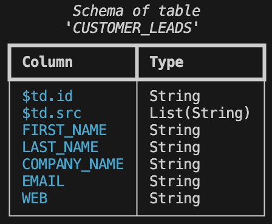
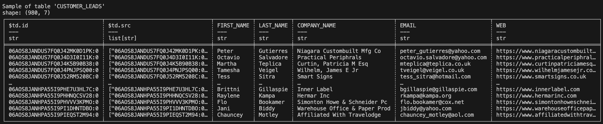

In this tutorial, we’ll explore how Tabsdata enables Pub/Sub for Tables.

We'll start by setting up the system and creating a publisher that reads data from a CSV file called `customers.csv` stored in an input directory in the local file system and selects certain columns of interest from it. This data will be published as a table called `CUSTOMER_LEADS` within a collection called `CUSTOMERS`. Collections are containers for related tables in Tabsdata, to make data organization and management more efficient. 

Next, we'll configure a subscriber to read data from this table and write it to an output directory on the local file system. 

Finally, we'll implement automated data engineering using Tabsdata to streamline the propagation of changes in the input files to downstream users.

In a real-world scenario, your data source could be a database, an S3 bucket, or another storage location, while the subscriber could write data to various endpoints such as a database or file system.

Let’s dive in! We’ll start by setting up the system to prepare us to work with the Tabsdata functions.

# Step 1. Setting up the system

## 1.1 Install/Update Tabsdata

To install/update the Tabsdata Python package, run this command in your CLI:

```
pip install tabsdata --upgrade
```

Please note that you need **Python 3.12 or later**, to install the package. Additionally, you need **Tabsdata python
package 0.9.2 or later** to successfully run the functions from this article.

### 1.2 Start the Tabsdata Server

To start the Tabsdata server, use the following command:

```
tdserver start
```

To verify that the Tabsdata server instance is running:

```
tdserver status
```

### 1.3 Copy the github repo

If you haven't already, copy the github repo to your system.

```
git clone https://github.com/tabsdata/tutorials
```

### 1.4 Setting up directory path for referencing files

In this tutorial, our data source is a CSV file on our file system in a particular input directory. Similarly, our
table subscriber will use capture the table data in a JSON line format file in a particular output directory.

For convenience we will use an environment variable called `TDX` for referencing the input and output location used
by the publisher and subscriber functions. Before we can do that, let's setup this variable to point to the base
directory of this tutorial. You can do this using the appropriate commands from below:

For Linux or MacOS:

```
cd tutorials
cd t01_csv_pub_sub
export TDX=`pwd`
```

For Windows:

```
cd tutorials
cd t01_csv_pub_sub
set TDX=%CD%
```

If you run an `ls` on `t01_csv_pub_sub` you would see the following files and folders:

```
README.md
input/
|__ customers_01.csv
|__ customers_02.csv
publisher.py
subscriber.py
assets/
|_table_sample.png 
|_table_schema.png
```

Here the folder `input` contains two files `customers_01.csv` and `customers_02.csv` that serve as input files. In
order to use these files, we will copy them over to `input/customers.csv` which will be used by the publisher function.
Later we will replace this file by `customers_02.cvs` by overwriting it to demonstrate that the newly published
data is automatically delivered to the subscriber.

There are two Python source files - `publisher.py` and `subscriber.py` - which contain the publisher and subscriber
functions. Feel free to take a peak at them - they are pretty straightforward. The assets folder has images for this
README file.

### 1.5 Login to the Tabsdata server

Before you can use Tabsdata, you must login to the server which can be done as follows:

```
td login localhost --user admin --password tabsdata
```


## Step 2: Publishing the input CSV as a table


Now that Tabsdata server is up and running, we can proceed to create our first publisher. A publisher is a simple
Python function that uses built-in connectors provided by Tabsdata to read data from external source(s) and map
it to one or more tables. A few things of note before we proceed:

* The publisher function uses decorators to define the input data source details and output table names.
* A publisher function is registered to a _Collection_ which acts as a container for tables. Consequently, any table(s)
created by the registered publisher function are contained in the collection where it is registered.
* The actual act of reading data from the data source(s) and publishing it to defined table(s) only happens when the
publisher function is invoked by a _trigger_. In this example, we will manually trigger the publisher function to make
it read the CSV file and publish it to a table within Tabsdata.


### 2.1 Creating a collection

In order to register our first publisher, we must create a collection. By default there are no collections within
Tabsdata unless you create one. You can see this by running the following command:

```
td collection list
```

For this tutorial, we will create a collection called CUSTOMERS where we will register our publisher function. To
create this collection use the following command:

```
td collection create CUSTOMERS
```

This should have created the collection that you can verify by running the previous list command. You can also see
more details about this collection using the `info` command as follows:

```
td collection info CUSTOMERS
```

### 2.2 Registering the publisher function

We will now register a publisher function that reads data from a CSV file on a specific input directory and publishes
some selected columns of this data to a table. For convenience, we have this function ready to use in the file
`publisher.py` and the name of this function is `publish_customers`. Here is what this function looks like:


```
@td.publisher(
    source = td.LocalFileSource(os.path.join(os.getenv("TDX"), "input", "customers.csv")),
    tables = ["CUSTOMER_LEADS"],
)

def publish_customers(tf: td.TableFrame):
    tf = tf.select(["IDENTIFIER", "GENDER", "NATIONALITY", "LANGUAGE", "OCCUPATION"])
    return tf

```

Here the `@td.publisher` decorator defines the following metadata:
* Data will be read from a a local file located at `$TDX/input/customers.csv`
* And the output of this function will be publised as a table called `CUSTOMER_LEADS`

The function definition is very simple in this case with the following details:
* The function name is `publish_customers` that takes a `TableFrame` called `tf`. Note that a `TableFrame` is the API
similar to a traditional `DataFrame` for use with Tabsdata. Note also that when this function executes, this input
`TableFrame` will be populated by the data read from the `$TDX/input/customers.csv` file as specified in the decorator.
* This function selects five specific columns from the input `TableFrame` and returns it as an output. Note that this
output `TableFrame` will be mapped to a table called `CUSTOMER_LEADS` as specified in the decorator.

That is all there is to a publisher. In a real world scenario, your publisher function can have many more inputs and
may produce many more out outputs. Moreover, the body of the function may do more complex operations on the data before
publishing them to output tables.

Register this publisher function to the `CUSTOMERS` collection using the following command.

```
td fn register --collection CUSTOMERS --fn-path $TDX/publisher.py::publish_customers
```

You can now verify that the function was registered successfully by running the following command:

```
td fn list --collection CUSTOMERS
```

This should confirm that the function `publish_customers` has been registered within the collection `CUSTOMERS`.


### 2.3 Triggering the publisher for the first time

As a reminder, registering a function in a collection does not execute it, and it must be invoked by a trigger. And if
a publisher function has never been triggerd, its corresponding output tables will not be initialized in the system.

Before we manually trigger the publisher function, we must make sure that the input CSV file exists in the correct
path. For our first run we will copy the provided sample input file `customers_01.csv` to the input location using
the following command:

```
cp $TDX/input/customers_01.csv $TDX/input/customers.csv
```

With this input CSV file now in place, let's trigger our publisher. This can be done using the following command:

```
td fn trigger --collection CUSTOMERS --name publish_customers
```

Once a function is triggerd, a detailed execution plan is created and set in motion by Tabsdata. You can read more
about this in [Tabsdata documentation](https://docs.tabsdata.com/latest/guide/04_working_with_functions/main_1.html).


### 2.4 Checking the publisher output

The Tabsdata table `CUSTOMER_LEADS` has been created in the `CUSTOMERS` collection. This table can now be subscribed
to, by various stakeholders within the organization.

To check the schema of the table in Tabsdata, run this command in your CLI:

```
td table schema --collection CUSTOMERS --name CUSTOMER_LEADS
```

Output:



The columns `$td.id` and `$td.src` are internal columns created by Tabsdata to track row level provenance
of data.

To check the sample of the table in Tabsdata, run this command in your CLI:

```
td table sample --collection CUSTOMERS --name CUSTOMER_LEADS
```

Output:



## Step 3: Subscribing to a published Table in Tabsdata

With the customer data available in Tabsdata as a table, it’s now ready for subscription. To demonstrate this we will
create our first subscriber. A subscriber is a simple Python function that reads data from tables published within
Tabsdata and uses built-in connectors provided by Tabasdata to send the data out to an external system. A few things
of note before we proceed:

* The subscriber function uses decorators to define the input table names an output data destinations.
* A subscriber function is registered to a Collection just like a publisher function. For the purposes of this tutorial
we will register our subscriber function within the same collection that we previously created -- `CUSTOMERS`.
* The actual act of reading data from the input tables and writing it to external systems only happens when the
subscriber function is invoked by a trigger. In this tutorial we will demonstrate two types of triggers for a
subscriber function -- a manual trigger that we will do to create our first output; and a dependency trigger that
automatically that happens when the source table changes.


### 3.1 Registering the subscriber function

We will now register a subscriber function that reads data from the CUSTOMERS_LEADS table created by our publisher
function in the prior steps, and externalizes this data in JSON line format to a specific output directory. For
convenience we have this function ready to use in the `subscriber.py` and the name of the function is
`subscribe_customers`. Here is what this function looks like:

```
@td.subscriber(
    tables = ["CUSTOMER_LEADS"],
    destination = td.LocalFileDestination(os.path.join(os.getenv("TDX"), "output", "customer_leads.jsonl")),
)

def subscribe_customers(tf: td.TableFrame):
    return tf
```

Here the `@td.subscriber` decorator defines the following metadata:
* Input data will be read from the table called `CUSTOMER_LEADS`
* And output of this function will be pushed to a file located at `$TDX/output/customer_leads.jsonl`

The function definition is very simple with following details:
* The function name is `subscribe_customers` that takes a `TableFrame` as input. When executed, this input will be
populated by the data coming from the `CUSTOMER_LEADS` table.
* The function simply returns the input data as its output, which is mapped to a specific output file as defined
by the decorator.

That is all there is to a subscriber. In a real world scenario, your subscriber function may take input data from
multiple tables, process it and create a derived output that is then sent to an external system.

Register this subscriber function to the `CUSTOMERS` collection using the following command:

```
td fn register --collection CUSTOMERS --fn-path $TDX/subscriber.py::subscribe_customers
```

You can now verify that the function was registered successfully bu running the following command:

```
td fn list --collection CUSTOMERS
```

This should confirm that the `subscribe_customers` has been registered within the collection `CUSTOMERS`.

### 3.2 Triggering the subscriber for the first time

As is also the case with publisher functions, registering the subscriber function does not execute it. It must be
executed by a trigger. In this step we will manually trigger the subscriber function for the first time and verify
the generated output.

We begin by making sure that there is no output directory present on our system. The following command should error
out:

```
ls $TDX/output
```

If this directory exists, go ahead and delete it. When the subscribe function is triggerd it will create the necessary
output directory store the output file.

Let's now manually trigger our subscriber function using the following command:

```
td fn trigger --collection CUSTOMERS --name subscribe_customers
```

As in the case of publisher functions, the triggering of a subscriber fucntion also generates an execution plan and
sets it in motion. You can more about this in
[Tabsdata documentation](https://docs.tabsdata.com/latest/guide/04_working_with_functions/main_1.html).


### 3.3 Checking the subscriber output:

Once executed, the subscriber would have generated the output file `customer_leads.jsonl` in the `$TDX/output`
directory.

Here is some sample data from `customer_leads.jsonl`:

```
{"IDENTIFIER":"74-93/03","GENDER":"Male","NATIONALITY":"Portuguese","LANGUAGE":"Italian","OCCUPATION":"Hod Carrier"}
{"IDENTIFIER":"68-52/94","GENDER":"Female","NATIONALITY":"Costa Rican","LANGUAGE":"Swati","OCCUPATION":"Aeronautical Engineer"}
{"IDENTIFIER":"37-41/89","GENDER":"Male","NATIONALITY":"Cuban","LANGUAGE":"Luxembourgish","OCCUPATION":"Telex Operator"}
```

As you see from the output file, only the columns selected from the `customers.csv` defined in `publisher.py` file have been exported, and the `jsonl` file is ready for consumption.

# Step 4: Automate Data Engineering

What happens when there is an update in your input data? How do you update the data used by the downstream users?

Let’s say there is an update in your CSV file, and 20 new customers get added to the CSV file. The `customers_02.csv`
file in the `input` directory presents one such scenario. This file has 20 new customers in addition to the customers
present in the `customers_01.csv` file that we loaded via the publisher when we triggered it for the first time.

Here are details of 3 new customers from the 20 who have been added:

| IDENTIFIER | NAME       | SURNAME | FIRST_NAME | LAST_NAME | FULL_NAME       | GENDER | GENDER_CODE | GENDER_SYMBOL | SEX    | PHONE_NUMBER  | TELEPHONE      | EMAIL                          | BIRTHDATE  | NATIONALITY | LANGUAGE | LOCALE    | BLOOD_TYPE | HEIGHT | WEIGHT | UNIVERSITY                                         | ACADEMIC_DEGREE | TITLE | OCCUPATION           | POLITICAL_VIEWS | WORLDVIEW          | USERNAME          | PASSWORD     |
|-------------|------------|---------|-------------|-----------|------------------|--------|--------------|----------------|--------|----------------|-----------------|-------------------------------|------------|--------------|-----------|------------|-------------|--------|--------|-----------------------------------------------------|------------------|-------|----------------------|------------------|---------------------|--------------------|--------------|
| 21-12/62     | Dakota      | Baxter  | Louetta      | Myers     | Tracy Ball        | Other  | 1            | ♂               | Female | +12272974320   | +16146882188    | drainage2086@duck.com         | 2022-11-04 | Swiss        | Zulu      | Locale.EN  | A+          | 1.79   | 38     | Western Connecticut State University (WCSU)        | PhD               | Mr.   | Medical Technician     | Moderate          | Pantheism           | networks_1867       | Gvwp+R+N     |
| 97-89/11     | Christinia  | Espinoza| Elden        | Alvarado  | Gerald Wolfe      | Female | 0            | ⚲               | Other  | +1-402-266-2114| +1-479-878-9781 | livestock1811@example.org     | 2014-05-09 | Dominican    | Yiddish   | Locale.EN  | A+          | 1.80   | 74     | Florida Gulf Coast University (FGCU)               | PhD               | Ms.   | Maid                  | Socialist          | Atheism             | throw_1882          | }&<h*EYp     |
| 92-54/93     | Perry       | Herman  | Amina        | Montgomery| Lory Justice      | Other  | 0            | ♀               | Female | +1-817-696-6699| +1-213-091-1513 | dynamic2052@duck.com          | 2018-12-24 | Salvadorian  | Greek     | Locale.EN  | B+          | 1.66   | 42     | University of South Florida (USF)                   | Bachelor           | B.Sc  | Town Planner           | Libertarian        | Secular humanism    | excitement_1908      | ]X4&n9yn     |

<br/>

**Important:** To simulate the new customers data being available as input, you need to replace the `customers.csv` file in the `input` folder with the `customers_new.csv` file in `input_02` and rename the it to `customers.csv`. With this, the new `customers.csv` in the `input` folder would have the data of 20 new customers.

## 4.1 Provisioning new input file

Before we can demonstrate the automatic execution of this workflow, we must provision the new input file in the correct
location for the publisher to read and publish it accordingly. This can be done using the following command:

```
cp $TDX/input/customers_02.csv $TDX/input/customers.csv
```

This will overwrite the `customers.csv` file that was previously copied from `customers_01.csv` file for our first
execution.

## 4.2 Saving first output file for comparison

When this new workflow executes, the subscriber will overwrite the output file `$TDX/output/customer_leads.jsonl` with
new data. Hence, let's create a backup of this file for later comparison using the following command:

```
cp $TDX/output/customer_leads.jsonl $TDX/output/customer_leads_01.jsonl
```

## 4.3 Trigger the pub/sub workflow

The publisher function that we registered earlier creates a table called `CUSTOMER_LEADS`. This table in turn has a
registered subscriber. Together, this publisher/subscriber pair makes a simple data engineering workflow. When the
publisher activates and updates the table, it will automatically trigger any subscribers for the updated tables.

To demonstrate this, we will trigger our publisher function manually. This should automatically trigger the subscriber
function which in turn should overwrite our expected output file. Since the new input file has 20 more customer
records, we expect that the output file will also have 20 more customer records available.

Use the following command to trigger the publisher to read new input file:

```
td fn trigger --collection CUSTOMERS --name publish_customers
```

Even though there is only one subscriber that was executed on refresh of the published table, it will work for any
number of subscribers that are registered.

## Check the Subscriber Output:

Once the publisher has been executed, you can check the `customer_leads.jsonl` file in the `output` folder to see if the changes are getting reflected.

Here is some sample data from the new `customer_leads.jsonl`:

```
{"IDENTIFIER":"21-12/62","GENDER":"Other","NATIONALITY":"Swiss","LANGUAGE":"Zulu","OCCUPATION":"Medical Technician"}
{"IDENTIFIER":"97-89/11","GENDER":"Female","NATIONALITY":"Dominican","LANGUAGE":"Yiddish","OCCUPATION":"Maid"}
{"IDENTIFIER":"92-54/93","GENDER":"Other","NATIONALITY":"Salvadorian","LANGUAGE":"Greek","OCCUPATION":"Town Planner"}
```

The above users were not present in the JSON file before, and have been added after the publisher was triggered with
the new `customers.csv` file. You can verify this by comparing the `customer_leads.jsonl` file with
`customer_leads_01.jsonl` that we saved for comparison earlier.


## Conclusion

We have successfully implemented a Pub/Sub for Tables using Tabsdata. We published the data from a CSV file as a table
after selecting certain columns from it. We then subscribed to the published table. We also demonstrated automatic
execution of the entire workflow when a data source was refreshed.


## Next Steps

For the next steps, here are a couple of experiements you can try:

* Add a Tabsdata
  [transformer](https://docs.tabsdata.com/latest/guide/04_working_with_functions/working_with_transformers/main.html)
  in the mix. Perform complex transformations on ``CUSTOMER_LEADS`` table using a Tabsdata tranformer, and connect the
  output table from the transformer to a subscriber.
* Read files from and write files to different external systems beyond local file system. You can read more about them
  [here](https://docs.tabsdata.com/latest/guide/supported_sources_and_destinations/main.html).


I hope this gave you a good introduction to the Tabsdata system! I'd love to hear your thoughts—let us know how we can
improve, what use cases you'd like us to cover in future blogs, or any other questions or feedback you have. Join the
conversation on [Discord](https://discord.gg/XRC5XZWppc),
[Github Discussions](https://github.com/tabsdata/tabsdata/discussions) or reach out to us
[here](https://www.tabsdata.com/contact).
