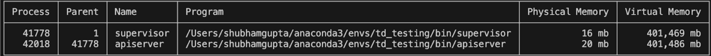
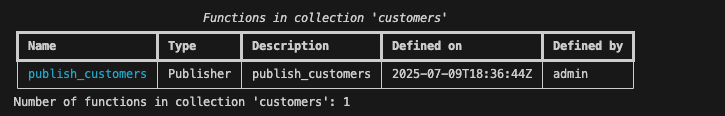
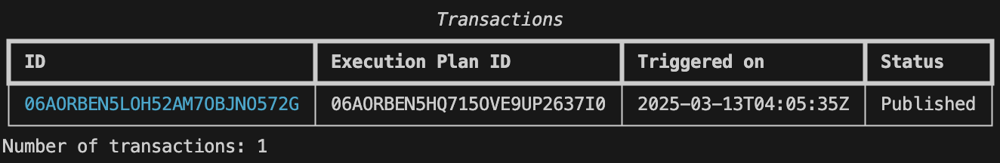
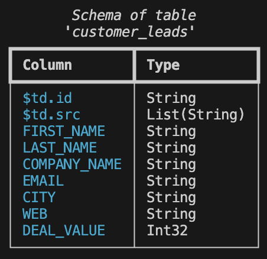
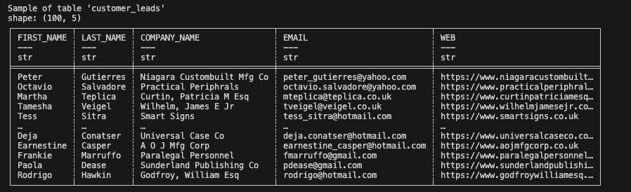
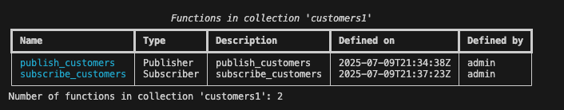

# Tutorial 2: Publishing and Subscribing a PostgreSQL Table (``t02_postgresql_pub_sub``)

In this tutorial, we’ll explore how Tabsdata enables Pub/Sub for Tables with source and destination data being a locally hosted PostgreSQL database.

We will start by setting up Tabsdata, and PostgreSQL. Then we register and run a publisher that reads data from PostgreSQL, and publishes that as a table to Tabsdata. Following that, we will register a subscriber that subscribes to this published table, filters some data, and exports it to PostgreSQL. We will then demonstrate that when the publisher is re-run to load new data, the subscriber automatically writes it to Postgres.

In a real-world scenario, your data source could be any other database, an S3 bucket, or another storage location, while the subscriber could write data to various endpoints such as a database or file system. You can check the list of source and destination connectors in [Tabsdata documentation](https://docs.tabsdata.com/latest/guide/04_01_working_with_publishers/main.html).

Let’s dive in!

## Step 1. Setting up the system

### 1.1 Setup the GitHub repo in local

#### 1.1.1 Copy the GitHub repository.

If you haven't already, clone the GitHub repo to your system.

Using SSH:

```
git clone git@github.com:tabsdata/tutorials.git
```

Using GitHub CLI:

```
gh repo clone tabsdata/tutorials
```

#### 1.1.2 Setup directory path for referencing files

In this tutorial, our data source and destination is PostgreSQL. The data for PostgreSQL is present in the SQL files in the tutorial folder. The Tabsdata functions to publish and subscribe to data are also in the tutorial folder.

For convenience we will use an environment variable called TDX for referencing the folder containing the Tabsdata functions and SQL files. To do that, let's set up this variable to point to the base directory of this tutorial. You can do this using the appropriate commands from below:

For Linux or macOS:

```
cd tutorials
cd t02_postgres_pub_sub
export TDX=`pwd`
```

For Windows Command Prompt:

```
cd tutorials
cd t02_postgres_pub_sub
set TDX=%CD%
```

If you run an ls (for Linux or macOS) or dir (Windows) on t02_csv_pub_sub you would see the following files and folders:

```
README.md
input/
|__ customers.sql
|__ customers_02.sql
publisher.py
subscriber.py
assets/
|_table_sample.png 
|_table_schema.png
|_ ....
```

### 1.2 Setup PostgreSQL

For this tutorial, we are using PostgreSQL as our input and output, and below are the steps to set that up.

#### 1.2.1 Install and Setup PostgreSQL

You can download PostgreSQL for your relevant OS from the [PostgreSQL website](https://www.postgresql.org/download/) or use the [docker image](https://hub.docker.com/_/postgres).

Once installed you can follow the [PostgreSQL documentation](https://www.postgresql.org/docs/current/tutorial-install.html) to get started.


#### 1.2.2 Create the db and input table

Assuming that you have successfully installed and set up PostgreSQL, you can run the following command to create the database to hold the input and output tables for this tutorial.

```
createdb customers
```

Run the following query to create the input Table “customer_leads” in the "customers" db with relevant data and columns:

```
psql customers -f "$TDX/input/customers.sql"
```

Output:

```
CREATE TABLE
INSERT 0 980
```

The above output indicates that the input table has been created.

#### 1.2.3 Storing the PostgreSQL credentials

Tabsdata supports different ways to store credentials that have been detailed [here](https://docs.tabsdata.com/latest/guide/secrets_management/main.html) in our documentation.

For ease of testing, you can store the PostgreSQL username and password as environment variables in your local system before starting the Tabsdata server as highlighted [here](https://docs.tabsdata.com/latest/guide/secrets_management/env_variables/main.html) in the documentation.

For the purpose of this tutorial, I am storing all the credentials in Hashicorp to present a more secure way that Tabsdata uses, to deal with credentials. You can see more details on how to set up Hashicorp [here](https://docs.tabsdata.com/latest/guide/secrets_management/hashicorp/main.html) in the Tabsdata documentation.

I have stored the PostgreSQL username and password under the variable names ``PG_USERNAME`` and ``PG_PASSWORD`` respectively in the Hashicorp Vault in the key store "td-pg". The same names are used in the Python code for Tabsdata functions. If you use different names, make sure that you change at both the places: Hashicorp and the Python code.

To set up HASHICORP, you will need to set the values of these environment variables as highlighted in the documentation. 

``TDS_HASHICORP_URL``, ``TDS_HASHICORP_TOKEN``, and ``TDS_HASHICORP_NAMESPACE``.

### 1.3 Setup Tabsdata

#### 1.3.1 Install/Update Tabsdata and PostgreSQL dependencies

To install/update the Tabsdata and PostreSQL dependencies, run these command in your CLI:

**Note**: You can use a virtual environment to run this command, or run it in your system directly.

```
pip install tabsdata --upgrade
pip install psycopg2-binary
```

Please note that you need Python v3.12 or later, to install the package. Additionally, you need Tabsdata python package v0.9.5 or later to successfully run the functions from this article.

#### 1.3.2 [Only if you have started a Tabsdata server before] Clearing the old Tabsdata instance

It is suggested that to work with newer versions of Tabsdata (v0.9.5 and above in this case), you remove the older Tabsdata instance, in case you have started the Tabsdata server earlier. This enables you to start from scratch, reducing the possibilities of error or conflicts.

Run the following commands in your CLI, to stop the Tabsdata server and clear the instance:

For Linux or macOS:

```
tdserver stop
rm -rf ~/.tabsdata
```

For Windows:

```
tdserver stop
rmdir /s /q "%USERPROFILE%\.tabsdata"
```

#### 1.3.3 Start the Tabsdata server

To start the Tabsdata server, use the following command:

```
tdserver start
```

To verify that the Tabsdata server instance is running:

```
tdserver status
```

Both, supervisor and apiserver need to become active for the server to be completely up and running.

Output:



The presence of supervisor and apiserv confirms that the server is running.

#### 1.3.4 Login to Tabsdata server

Before you can use Tabsdata, you must login to the server which can be done as follows:

```
td login localhost --user admin
```

When prompted from password put:

```
tabsdata
```

Output:

```
Login successful.
```

## Step 2: Publishing the input data from PostgreSQL to Tabsdata

Now with all the relevant pieces setup, we can proceed to create our first publisher. A publisher is a simple Python function that reads data from external source(s) and map it to one or more Tabsdata tables. It can connect to external systems using built-in connectors provided by Tabsdata, or you can create your own connectors. A few things to note before we proceed:
* The publisher function uses decorators to define the input data source details and output table names.
* A publisher function is registered to a Collection which acts as a container for tables. Consequently, any table(s) created by the registered publisher function are contained in the collection where it is registered.
* The actual act of reading data from the data source(s) and publishing it to a defined table(s) only happens when the publisher function is invoked by a trigger. In this example, we will manually trigger the publisher function to make it read the data from PostgreSQL and publish it to a table within Tabsdata.

### 2.1 Creating a collection

In order to register our first publisher, we must create a collection. By default there are no collections within a Tabsdata server until you create one.

You can see this by running the following command:

```
td collection list
```

For this tutorial, we will create a collection called "customers" to register our functions and hold the output Tabsdata tables. To create this collection use the following command:

```
td collection create customers
```

This should have created the collection that you can verify by running the previous list command. You can also see more details about this collection using the info command as follows:

```
td collection info customers
```

### 2.2 Registering the publisher function

We will now register a publisher function that reads data from PostgreSQL and publishes some selected columns of this data to a table. For convenience, we have this function ready to use in the file ``publisher.py`` and the name of this function is ``publish_customers``. Here is what this function looks like:

```
import tabsdata as td

pg_username = td.HashiCorpSecret("td-pg", "PG_USERNAME")
pg_password = td.HashiCorpSecret("td-pg", "PG_PASSWORD")

@td.publisher(
    source=td.PostgresSource(
        uri="postgres://127.0.0.1:5432/customers",
        query=[
            "select * from customer_leads;",
        ],
        credentials=td.UserPasswordCredentials(pg_username, pg_password),
    ),

    # Name of the table created in the Tabsdata collection.
    tables = ["customer_leads"],
)

def publish_customers(tf: td.TableFrame):
    return tf
```

Here the @td.publisher decorator defines the following metadata:
* Input of this function will be from the table ``customers`` in the PostgreSQL database “customers” hosted locally. ``pg_username`` and ``pg_password`` are PostgreSQL credentials to access the database, retrieved from the Hashicorp Vault.
* Output of this function will be published to Tabsdata as a table called ``customer_leads``.

The function definition is very simple in this case with the following details:
* The function name is ``publish_customers`` that takes a TableFrame called ``tf``. Note that a TableFrame is the API similar to a traditional DataFrame. Note also that when this function executes, this input TableFrame will be populated by the data read from PostgreSQL table as specified in the decorator.
* This function returns the TableFrame as is, as an output. The output TableFrame will be mapped to a Tabsdata table called "customer_leads" as specified in the decorator.

That is all there is to a publisher. In a real world scenario, your publisher function can have many more inputs and may produce many more outputs. Moreover, the body of the function may do more complex operations on the data before publishing them to output tables. You can read more about that in the [Tabsdata documentation](https://docs.tabsdata.com/latest/guide/06_working_with_tables/table_frame.html). Register this publisher function to the "customers" collection using the following command.

```
td fn register --collection customers --fn-path $TDX/publisher.py::publish_customers
```

You can now verify that the function was registered successfully by running the following command:

```
td fn list --collection customers
```

Output:



This output confirms that the function `publish_customers` has been registered within the collection `customers`.

### 2.3 Triggering the publisher

As a reminder, registering a function in a collection does not execute it, and it must be invoked by a trigger. And if a publisher function has never been triggered, its corresponding output tables will not be initialized in the system.

Let's trigger our publisher. This can be done using the following command:

```
td fn trigger --collection customers --name publish_customers
```

You can see the status whether the functions have finished executing by using the following command:

```
td exec list-trxs
```

Output:



If the function has finished executing, you will see Published in the status.

### 2.4 Checking the publisher output

The Tabsdata table "customer_leads" has been created in the "customers" collection. This table can now be subscribed to, by various stakeholders within the organization.

To check the schema of the table in Tabsdata, run this command in your CLI:

```
td table schema --collection customers --name customer_leads
```

Output:



The columns `$td.id` and `$td.src` are columns created by Tabsdata to track row level provenance
of data.


To check the sample of the table in Tabsdata, run this command in your CLI:

```
td table sample --collection customers --name customer_leads
```

Output:



## Step 3: Subscribing to the Table in Tabsdata and send output to PostgreSQL

We’ll now create a subscriber to send data to PostgreSQL. This subscriber will create or update the ``high_value_customer_leads`` table in the ``customers`` database in PostgreSQL.

### 3.1 Registering the subscriber function

We will now register a subscriber function that reads data from the "customer_leads" table created by our publisher function in the prior steps, and externalizes this data to PostgreSQL. For convenience we have this function ready to use in the ``subscriber.py`` and the name of the function is ``subscribe_customers``. Here is what this function looks like:

```
import tabsdata as td

@td.subscriber(
    # Name of the table to be exported from Tabsdata.
    tables = ["customer_leads"],

    # Postgres details for the data to be written by the Subscriber.
    destination=td.PostgresDestination(
        uri="postgres://127.0.0.1:5432/customers",
        destination_table=["high_value_customer_leads"],
        credentials=td.UserPasswordCredentials(pg_username, pg_password),
        if_table_exists="replace",
    ),
)

def subscribe_customers(tf: td.TableFrame):
    output_tf = tf.filter(td.col("DEAL_VALUE") >= 4000)
    return output_tf
```

Here the @td.subscriber decorator defines the following metadata:
* Input will be read from the Tabsdata table called "customer_leads"
* And output of this function will be pushed to the ``high_value_customer_leads`` table in PostgreSQL. If the table is not present it will be created, and if the table exists it will be replaced. You can modify the ``if_table_exists`` to ``append`` if you want the new rows to be addended the existing table. It defaults to ``append``.

The function definition is very simple with following details:
* The function name is ``subscribe_customers`` that takes a TableFrame as input. When executed, this input will be populated by the data coming from the "customer_leads" table.
* The function selects those customers with deal value equal to or higher than 4000. This output is mapped to the ``high_value_customer_leads`` table in the "customers" database in PostgreSQL.

In a real world scenario, your subscriber function may take input data from multiple tables, process it and create a derived output that is then sent to an external system.

Register this subscriber function to the "customers" collection using the following command:

```
td fn register --collection customers --fn-path $TDX/subscriber.py::subscribe_customers
```

You can verify that the function was registered successfully by running the following command:

```
td fn list --collection customers
```

Output:



### 3.2 Triggering the subscriber

As is the case with publisher functions, registering the subscriber function does not execute it. It must be executed by a trigger. In this step we will manually trigger the subscriber function and verify the generated output.

Let's now trigger our subscriber function using the following command:

```
td fn trigger --collection customers --name subscribe_customers
```

Remember that you can see the status whether the functions have finished executing by using the following command:

```
td exec list-trxs
```

If the function has finished executing, you will see Published in the status.

### 3.3 Checking the subscriber output:

Once executed, the subscriber would have generated the ``high_value_customer_leads`` table with the relevant details in the ``customers`` database in PostgreSQL.

You can run the following command to check the output in PostgreSQL:

```
SELECT * FROM high_value_customer_leads LIMIT 10;
```


## Step 4: Automatic execution of dependencies

What happens when there is an update in your input data? How do you update the data used by the downstream users?

Let’s say there is an update in your input PostgreSQL table, and new customers get added to it. The ``customers_02.sql`` file in the input directory presents one such scenario. This file has 20 new customers to be added to the ``customer_leads`` table.

### 4.1 Updating the PostgreSQL table

Before we can demonstrate the automatic execution of this workflow, we must add the new data to the ``customer_leads`` table in the ``customers`` database of PostgreSQL.

This can be done using the following command:

```
psql customers -f "$TDX/input/customers_02.sql"
```

Output:

```
INSERT 0 20
```

### 4.2 Saving previous outputs for comparison

When this new workflow executes, the subscriber will overwrite the output table in PostgreSQL with new data. Hence, let's create a backup of this table for later comparison using the following command:

You can use the following command to create a copy of the PostgreSQL table created by the subscriber.

```
CREATE TABLE high_value_customer_leads_01 AS TABLE high_value_customer_leads;
```

### 4.3 Trigger the Pub/Sub workflow

The publisher function that we registered earlier creates a table called ``customer_leads``. This table in turn has two registered subscribers. Together the publisher and subscribers make a simple data engineering workflow. When the publisher activates and updates the table, it will automatically trigger the subscribers to update their output.

To demonstrate this, we will trigger our publisher function. This should automatically trigger the subscriber functions which in turn should update the ``high_value_customer_leads`` table in PostgreSQL.

Use the following command to trigger the publisher to read new input file:

```
td fn trigger --collection customers --name publish_customers
```

Remember that you can see the status whether the functions have finished executing by using the following command:

```
td exec list-trxs
```

If the function has finished executing, you will see Published in the status.

In this example, there is only one subscriber that was executed on refresh of the published table. However, it will work for any number of subscribers that are registered and have their input tables associated with the publisher.

### 4.4 Check the output of Subscribers

The ``high_value_customer_leads`` table in PostgreSQL would have been updated with the new data. You can run the command below, to check the difference between the old and new table.

```
SELECT 
  t1.cnt AS high_value_customer_leads_count,
  t2.cnt AS high_value_customer_leads_01_count,
  t1.cnt - t2.cnt AS count_difference
FROM 
  (SELECT COUNT(*) AS cnt FROM high_value_customer_leads) t1,
  (SELECT COUNT(*) AS cnt FROM high_value_customer_leads_01) t2;

```

Output:


Out of 20, 12 items have been added. These are the ones with deal value higher than or equal to $4000.

## Conclusion

We have successfully implemented a Pub/Sub for Tables using Tabsdata. We published the data from PostgreSQL database to Tabsdata after selecting certain columns from it. We then subscribed to the published table, filtered it based on certain criteria, and exported the data to PostgreSQL. We also demonstrated automatic execution of the entire workflow when the data source was refreshed.

## Next Steps

For the next steps, you can try adding a Tabsdata [transformer](https://docs.tabsdata.com/latest/guide/04_working_with_functions/working_with_transformers/main.html) in the mix. Perform complex transformations on the "customer_leads" table using a Tabsdata transformer, and connect the output table from the transformer to various subscribers. You can also experiment with different sources and destinations, beyond PostgreSQL.

I hope this gave you a better understanding of the Tabsdata system! I'd love to hear your thoughts—let us know how we can improve, what use cases you'd like us to cover in future blogs, or any other questions or feedback you have. Join the conversation on [Discord](https://discord.gg/XRC5XZWppc), [Slack](https://join.slack.com/t/tabsdata-community/shared_invite/zt-322toyigx-ZGFioMV2Gbza4bJDAR7wSQ), [GitHub Discussions](https://github.com/tabsdata/tabsdata/discussions) or reach out to us [here](https://www.tabsdata.com/contact).
