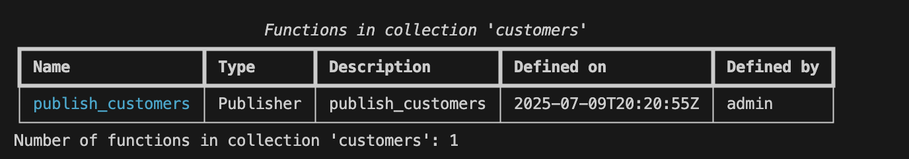
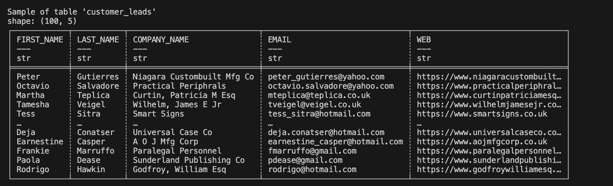

# Tutorial 3: Pre-processing, Publishing and Subscribing a CSV to AWS Glue Iceberg (`t03_csv_icerberg_pub_sub`)

In this tutorial, we’ll explore how Tabsdata enables exporting CSV data from local file system as an Iceberg table to AWS.

We will start by setting up Tabsdata and registering a publisher that reads data from a CSV file, selects
some aspects of it, and publishes it as a table within Tabsdata. Following that, we will register a subscriber that
subscribes to this published table, and exports it as an Iceberg Table to AWS. We will then demonstrate
that when the publisher is rerun to load new data, the subscriber automatically writes it to the external system.

In a real-world scenario, your data source could be a database, an S3 bucket, or another storage location, while the 
subscriber could write data to various endpoints such as a database or file system.

If you get stuck somewhere, please remember to check [our Troubleshooting guide](https://docs.tabsdata.com/latest/guide/10_troubleshooting/main.html), and reach out to us on [Slack](https://join.slack.com/t/tabsdata-community/shared_invite/zt-322toyigx-ZGFioMV2Gbza4bJDAR7wSQ). Your feedback helps us improve.

Let’s dive in!

## Step 1. Setting up the system

### 1.1 Setup the GitHub repo in local

#### 1.1.1 Copy the GitHub repository.

If you haven't already, clone the GitHub repo to your system.

Using SSH:

```
git clone git@github.com:tabsdata/tutorials.git
```

Using GitHub CLI:

```
gh repo clone tabsdata/tutorials
```

#### 1.1.2 Setup directory path for referencing files

In this tutorial, our data source is a CSV file on our file system in an input directory in the above Github repo. Our output is an Iceberg table in AWS. The Tabsdata functions to publish and subscribe are also in the tutorial folder.

For convenience we will use an environment variable called `TDX` for referencing the folder containing the Tabsdata functions and input folder. To do that, let's set up `TDX` variable to point to the base directory of this tutorial. You can do this using the appropriate commands from below:

For Linux or macOS:

```
cd tutorials
cd t03_csv_iceberg_pub_sub
export TDX=`pwd`
```

For Windows Command Prompt:

```
cd tutorials
cd t03_csv_iceberg_pub_sub
set TDX=%CD%
```

If you run an `ls` (for Linux or macOS) or `dir` (Windows) on `t03_csv_iceberg_pub_sub` you would see the following files and folders:

```
README.md
input/
|__ customers.csv
|__ customers_02.csv
publisher.py
subscriber.py
assets/
|_table_sample.png 
|_table_schema.png
|_ ....
```

### 1.2 Setup AWS Glue and S3 in AWS

Since we are exporting our data to an Iceberg Table in AWS, we need an S3 bucket URL, AWS Glue Database name and the S3 credentials to access the relevant services, to send the data to AWS.

#### 1.2.1 Obtain the bucket URL

You can follow this [AWS documentation](https://docs.aws.amazon.com/AmazonS3/latest/userguide/create-bucket-overview.html) to create a new bucket. 

The bucket URL is of the format: s3://bucket-name/.

In my python code, I have named the bucket `td-iceberg`. You won't be able to use the same name since the bucket urls are unique globally across all AWS accounts, and regions. Hence, remember to change the bucket name in your Python code.

#### 1.2.2 Obtain the Database name in AWS Glue Data Catalog

You can follow this [AWS documentation](https://docs.aws.amazon.com/glue/latest/dg/define-database.html) to create a new database in AWS Glue Data Catalog.

In my python code, I have named the database `td-iceberg`. You can use the same name for the database since these are not required to be unique.

#### 1.2.3 Obtain and Store the S3 access credentials

You can follow this [AWS documentation](https://docs.aws.amazon.com/solutions/latest/data-transfer-hub/set-up-credentials-for-amazon-s3.html#step-2-create-a-user) to obtain the credentials, Access ID and Secret Key. These enable us to upload data to the S3 bucket programmatically.

We have different ways to store credentials that have been detailed here in [our documentation](https://docs.tabsdata.com/latest/guide/secrets_management/hashicorp/main.html). For the purpose of this tutorial, I am storing all the credentials in Hashicorp.

I have stored the S3 Access ID and Secret Key under the variable names ``AWS_ACCESS_KEY_ID`` and ``AWS_SECRET_ACCESS_KEY`` respectively in the Hashicorp Vault in the default key store "sample-secret". The same names are used in the Python code for Tabsdata functions. If you use different names, make sure that you change at both the places: Hashicorp and the Python code.

To set up HASHICORP, you will need to set the values of these environment variables as highlighted in the [Tabsdata documentation](https://docs.tabsdata.com/latest/guide/secrets_management/hashicorp/main.html). 

```
export TDS_HASHICORP_URL=<hashicorp_vault_url>
export TDS_HASHICORP_TOKEN=<hashicorp_vault_token>
[optional] export TDS_HASHICORP_NAMESPACE=<hashicorp_namespace>
```

You can also store the credentials as environment variables in your system before starting the Tabsdata server as highlighted [here](https://docs.tabsdata.com/latest/guide/secrets_management/env_variables/main.html) in the documentation.

```
export AWS_ACCESS_KEY_ID=<your_s3_access_key>
export AWS_SECRET_ACCESS_KEY=<your_s3_secret_key>
```
**Important**: If you use the environment variables, you will need to modify the Python code accordingly.

```
s3_credentials=td.S3AccessKeyCredentials(
    td.EnvironmentSecret("AWS_ACCESS_KEY_ID"), td.EnvironmentSecret("AWS_SECRET_ACCESS_KEY")
)
```

### 1.3 Setup Tabsdata

#### 1.3.1 Install/Update Tabsdata

To install/update the Tabsdata Python package, run this command in your CLI:

```
pip install tabsdata --upgrade
```

Please note that you need Python 3.12 or later, to install the package. Additionally, you need Tabsdata python package 0.9.5 or later to successfully run the functions from this article.

#### 1.3.2 [Only if you have started a Tabsdata server before] Clearing the old Tabsdata instance

It is suggested that to work with newer versions of Tabsdata (v0.9.5 and above in this case), you remove the older Tabsdata instance, in case you have started the Tabsdata server earlier. This enables you to start from scratch, reducing the possibilities of error or conflicts.

Run the following commands in your CLI, to stop the Tabsdata server and clear the instance:

For Linux or macOS:

```
tdserver stop
rm -rf ~/.tabsdata
```

For Windows:

```
tdserver stop
rmdir /s /q "%USERPROFILE%\.tabsdata"
```

#### 1.3.3 Start the Tabsdata server

To start the Tabsdata server, use the following command:

```
tdserver start
```

To verify that the Tabsdata server instance is running:

```
tdserver status
```

Output:

You may need to wait for a couple of seconds for the output to appear. Run the status check command until you see both `supervisor` and `apiserver` in the output.


The presence of supervisor and apiserv confirms that the server is running.

#### 1.3.4 Login to Tabsdata server

Before you can use Tabsdata, you must login to the server which can be done as follows:

```
td login localhost --user admin
```

When prompted from password put:

```
tabsdata
```

Output:

```
Login successful.
```

## Step 2: Publishing the input CSV as a table

Now that Tabsdata server is up and running, we can proceed to create our first publisher. A publisher is a simple
Python function that uses built-in connectors provided by Tabsdata to read data from external source(s) and map
it to one or more tables. A few things of note before we proceed:

* The publisher function uses decorators to define the input data source details and output table names.
* A publisher function is registered to a _Collection_ which acts as a container for tables. Consequently, any table(s)
created by the registered publisher function are contained in the collection where it is registered.
* The actual act of reading data from the data source(s) and publishing it to defined table(s) only happens when the
publisher function is invoked by a _trigger_. In this example, we will manually trigger the publisher function to make
it read the CSV file and publish it to a table within Tabsdata.


### 2.1 Creating a collection

In order to register our first publisher, we must create a collection. By default there are no collections within a 
Tabsdata server until you create one. You can see this by running the following command:

```
td collection list
```

For this tutorial, we will create a collection called `customers` where we will register our publisher function. To
create this collection use the following command:

```
td collection create customers
```

This should have created the collection that you can verify by running the previous list command. You can also see
more details about this collection using the `info` command as follows:

```
td collection info customers
```

Output:


This output confirms that the collection called `customers` has been created.

### 2.2 Registering the publisher function

We will now register a publisher function that reads data from a CSV file on a specific input directory and publishes
some selected columns of this data to a table. For convenience, we have this function ready to use in the file
`publisher.py` and the name of this function is `publish_customers`. Here is what this function looks like:


```
@td.publisher(
    source = td.LocalFileSource(os.path.join(os.getenv("TDX"), "input", "customers.csv")),
    tables = ["customer_leads"],
)

def publish_customers(tf: td.TableFrame):
    output_tf = tf.select(["FIRST_NAME","LAST_NAME","COMPANY_NAME","EMAIL","WEB"])
    return output_tf

```

Here the `@td.publisher` decorator defines the following metadata:
* Data will be read from a local file located at `$TDX/input/customers.csv`
* And the output of this function will be publised as a table called `customer_leads`

The function definition is very simple in this case with the following details:

* The function name is `publish_customers` that takes a `TableFrame` called `tf`. Note that `TableFrame` is similar to a traditional `DataFrame` with some additional properties specific to Tabsdata. Note also that when this function executes, this input
`TableFrame` will be populated by the data read from the `$TDX/input/customers.csv` file as specified in the decorator.

* This function selects five specific columns from the input `TableFrame` and returns it as an output. Note that this
output `TableFrame` will be mapped to a table called `customer_leads` as specified in the decorator.

That is all there is to a publisher. In a real world scenario, your publisher function can have many more inputs and
may produce many more outputs. Moreover, the body of the function may do more complex operations on the data before
publishing them to output tables.

Register this publisher function to the `customers` collection using the following command.

```
td fn register --collection customers --fn-path $TDX/publisher.py::publish_customers
```

You can now verify that the function was registered successfully by running the following command:

```
td fn list --collection customers
```
Output:



This output confirms that the function `publish_customers` has been registered within the collection `customers`.


### 2.3 Triggering the publisher

As a reminder, registering a function in a collection does not execute it, and it must be invoked by a trigger. And if
a publisher function has never been triggered, its corresponding output tables will not be initialized in the system.

<!-- 
Before we manually trigger the publisher function, we must make sure that the input CSV file exists in the correct
path. For our first run we will copy the provided sample input file `customers_01.csv` to the input location using
the following command:

For Linux or macOS:
```
cp $TDX/input/customers_01.csv $TDX/input/customers.csv
```

For Windows Command Prompt:
```
copy %TDX%\input\customers_01.csv %TDX%\input\customers.csv
``` -->

<!-- With this input CSV file now in place, let's trigger our publisher. This can be done using the following command: -->

Let's trigger our publisher. This can be done using the following command:

```
td fn trigger --collection customers --name publish_customers
```

You can see the status whether the functions have finished executing by using the following command:

```
td exec list-trxs
```

Output:


If the function has finished executing, you will see Published in the status. If you see `Failed`, please remember to check [our Troubleshooting guide](https://docs.tabsdata.com/latest/guide/10_troubleshooting/main.html), and reach out to us on [Slack](https://join.slack.com/t/tabsdata-community/shared_invite/zt-322toyigx-ZGFioMV2Gbza4bJDAR7wSQ). Your feedback helps us improve.

### 2.4 Checking the publisher output

The Tabsdata table `customer_leads` has been created in the `customers` collection. This table can now be subscribed
to, by various stakeholders within the organization.

To check the schema of the table in Tabsdata, run this command in your CLI:

```
td table schema --collection customers --name customer_leads
```

Output:


The columns `$td.id` and `$td.src` are internal columns created by Tabsdata to track row level provenance
of data.

To check the sample of the table in Tabsdata, run this command in your CLI:

```
td table sample --collection customers --name customer_leads
```

Output:



## Step 3: Subscribing to the Table in Tabsdata and send output to S3

With the customer data available in Tabsdata as a table, it’s now ready for subscription. To demonstrate this we will create our first subscriber. A subscriber is a simple Python function that reads data from tables published within Tabsdata and uses built-in connectors provided by Tabasdata to send the data out to an external system. A few things to note before we proceed:
* The subscriber function uses decorators to define the input table names and output data destinations.
* A subscriber function is registered to a Collection just like a publisher function. For the purposes of this tutorial we will register our subscriber function within the same collection that we previously created -- `customers`.
* The actual act of reading data from the input tables and writing it to external systems only happens when the subscriber function is invoked by a trigger. In this tutorial we will demonstrate two types of triggers for a subscriber function -- a manual trigger that we will do to create our first output; and a dependency trigger that automatically happens when the source table changes.

### 3.1 Change the bucket and database names in the subscriber function

Change the following snippet of code in your `subscriber.py` file to reflect your S3 bucket url (replace `s3://td-iceberg`), and its region (`us-west-1`).

Change the below:

```
destination = ......
    uri=["s3://td-iceberg/customers-$EXPORT_TIMESTAMP.parquet"],
    region="us-west-1"
```

to:

```
destination = ......
    uri=["s3://<your_s3_bucket_name>/customers-$EXPORT_TIMESTAMP.parquet"],
    region="<your_s3_bucket_region>"
```

For AWS Glue data catalog details, change the following code snippet: database name (replace `td-iceberg` in `td-iceberg.customers`), S3 bucket url (replace `s3://td-iceberg`), and client region (`us-west-1`).

Change the below:

```
catalog = .....
        "client.region": "us-west-1",
    ......
    tables=["td-iceberg.customers"],
    auto_create_at="s3://td-iceberg",

```

to:

```
catalog = .....
        "client.region": "<your_s3_bucket_region>",
    ......
    tables=["<your_aws_glue_data_catalog_database_name>.customers"],
    auto_create_at="s3://<your_s3_bucket_name>",

```

The S3 bucket when defining destination and catalog need to be same. This is because destination holds the base parquet files, and catalog creates the metadata folder on top of those parquet files. Both of these combined create Iceberg tables.

### 3.2 Registering the subscriber function

We will now register a subscriber function that reads data from the `customer_leads` table created by our publisher function in the prior steps, and externalizes this data as an Iceberg table to AWS. For convenience we have this function ready to use in the `subscriber.py` and the name of the function is ``sub_s3_iceberg``. Here is what this function looks like:

```
import tabsdata as td

s3_credentials=td.S3AccessKeyCredentials(
    td.HashiCorpSecret("sample-secret", "AWS_ACCESS_KEY_ID"), 
    td.HashiCorpSecret("sample-secret", "AWS_SECRET_ACCESS_KEY")
)

@td.subscriber(
    tables=["customer_leads"],
    destination=td.S3Destination(
        uri=["s3://td-iceberg/customers-$EXPORT_TIMESTAMP.parquet"],
        region="us-west-1",
        credentials=s3_credentials,

        # Adding Iceberg table in AWS Glue data catalog
        catalog = td.AWSGlue(
            definition= {
                "name": "default",
                "type": "glue",
                "client.region": "us-west-1",
            },
            tables=["td-iceberg.customers"],
            auto_create_at="s3://td-iceberg",
            if_table_exists="replace",
            credentials = s3_credentials
        )
    )
)

def sub_s3_iceberg(tf: td.TableFrame) -> td.TableFrame:
    return tf

```

Here the @td.subscriber decorator defines the following metadata:
* Input will be read from the Tabsdata table called `customer_leads`.
* And output of this function will be pushed to S3 and AWS Glue Data Catalog as an Iceberg table `customers`. S3 stores the parquet file and the metadata related to the Iceberg table. The table is defined in AWS Glue Data Catalog as `customers` in `td-iceberg` database. `auto_create_at` defines the location of metadata.

The function definition is very simple with following details:
* The function name is `sub_s3_iceberg` that takes a TableFrame as input. When executed, this input will be populated by the data coming from the `customer_leads` table.
* The output is returned and exported as Iceberg table without any modifications.

In a real world scenario, your subscriber function may take input data from multiple tables, process it and create a derived output that is then sent to an external system.

Register this subscriber function to the `customers` collection using the following command:

```
td fn register --collection customers --fn-path $TDX/subscriber.py::sub_s3_iceberg
```

You can now verify that the function was registered successfully by running the following command:

```
td fn list --collection customers
```

Output:


This output confirms that the “sub_s3_iceberg” has been registered within the collection `customers`.

### 3.3 Triggering the subscriber

As is the case with publisher functions, registering the subscriber function does not execute it. It must be executed by a trigger. In this step we will manually trigger the subscriber function and verify the generated output.

Let's now trigger our subscriber function using the following command:

```
td fn trigger --collection customers --name sub_s3_iceberg
```

Remember that you can see the status whether the functions have finished executing by using the following command:

```
td exec list-trxs
```

Output:


If the function has finished executing, you will see Published in the status. If you see `Failed`, please remember to check [our Troubleshooting guide](https://docs.tabsdata.com/latest/guide/10_troubleshooting/main.html), and reach out to us on [Slack](https://join.slack.com/t/tabsdata-community/shared_invite/zt-322toyigx-ZGFioMV2Gbza4bJDAR7wSQ). Your feedback helps us improve.

### 3.4 Checking the subscriber output:

Once executed, the subscriber would have generated the output parquet file and metadata folder in the S3 bucket, and table in the database in AWS Glue Data Catalog.

You can check the number of rows and the output by running queries on top of the table in AWS Glue Data Catalog using Amazon Athena.

Output in S3:


S3 has 1 parquet files representing the output from this run. This parquet file can be downloaded and opened with the appropriate software to read the output.

Output from query on top of Iceberg table:


The number of rows 980 matches with the number of rows in `customers.csv` file.

## Step 4: Automatic execution of dependencies

What happens when there is an update in your input data? How do you update the data used by the downstream users?

Let’s say there is an update in your CSV file, and 20 new customers get added to the CSV file. The `customers_02.csv`
file in the `input` directory presents one such scenario. This file has 20 new customers in addition to the customers
present in the `customers.csv` file that we loaded via the publisher when we triggered it for the first time.

### 4.1 Provisioning new input file

Before we can demonstrate the automatic execution of this workflow, we must provision the new input file in the correct
location for the publisher to read and publish it accordingly. This can be done using the following command:

For Linux or macOS:
```
cp $TDX/input/customers_02.csv $TDX/input/customers.csv
```

For Windows Command Prompt:
```
copy %TDX%\input\customers_02.csv %TDX%\input\customers.csv
```

<!-- This will overwrite the `customers.csv` file that was previously copied from `customers_01.csv` file for our first
execution. -->

This will overwrite the previous version of `customers.csv` file that we were working with.

### 4.2 Trigger the Pub/Sub workflow

The publisher function that we registered earlier creates a table called ``customer_leads``. This table in turn has a
registered subscriber. Together, this publisher/subscriber pair makes a simple data engineering workflow. When the
publisher activates and updates the table, it will automatically trigger any associated subscribers to update their respective output.

To demonstrate this, we will trigger our publisher function. This should automatically trigger the ``sub_s3_iceberg`` subscriber function which in turn should generate a new parquet file and update the Iceberg table metadata.

Use the following command to trigger the publisher to read new input file:

```
td fn trigger --collection customers --name publish_customers
```

Remember that you can see the status whether the functions have finished executing by using the following command:

```
td exec list-trxs
```

Output:


If the function has finished executing, you will see Published in the status. If you see `Failed`, please remember to check [our Troubleshooting guide](https://docs.tabsdata.com/latest/guide/10_troubleshooting/main.html), and reach out to us on [Slack](https://join.slack.com/t/tabsdata-community/shared_invite/zt-322toyigx-ZGFioMV2Gbza4bJDAR7wSQ). Your feedback helps us improve.

In this example, there is only one subscriber that was executed on refresh of the published table. However, it will work for any number of subscribers that are registered and have their input tables associated with the publisher.

### 4.4 Check the output of Subscribers

You can open your respective S3 bucket and AWS Glue Data Catalog Table to check the output and interact with the Iceberg table.

Output in S3:


S3 has 2 parquet files representing 2 output from 2 different runs. These parquet files can be downloaded and opened with the appropriate software to read the output.

Output from query on top of Iceberg table:


The number of rows 1000 matches with the number of rows in the new `customers.csv` file.

## Conclusion

We have successfully implemented a Pub/Sub for Tables using Tabsdata. We published the data from local file system to Tabsdata after selecting certain columns from it. We then subscribed to the published table, filtered it based on certain criteria, and exported the data to AWS as Iceberg Table. We also demonstrated automatic execution of the entire workflow when the data source was refreshed.

## Next Steps

For the next steps, you can try adding a Tabsdata [transformer](https://docs.tabsdata.com/latest/guide/04_working_with_functions/working_with_transformers/main.html) in the mix. Perform complex transformations on the "customer_leads" table using a Tabsdata transformer, and connect the output table from the transformer to various subscribers. You can also experiment with different sources and destinations, beyond PostgreSQL.

I hope this gave you a better understanding of the Tabsdata system! I'd love to hear your thoughts—let us know how we can improve, what use cases you'd like us to cover in future blogs, or any other questions or feedback you have. Join the conversation on [Slack](https://join.slack.com/t/tabsdata-community/shared_invite/zt-322toyigx-ZGFioMV2Gbza4bJDAR7wSQ) or reach out to us [here](https://www.tabsdata.com/contact).