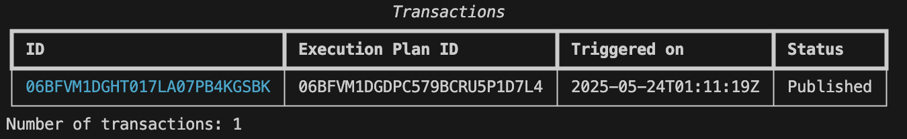
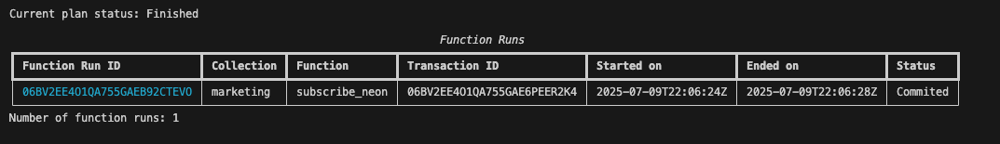

# Tutorial 4: Pre-processing, Publishing and Subscribing a Google Sheet to Neon PostgreSQL (`t04_gsheet_neon`)

In this tutorial, we’ll explore how Tabsdata enables exporting data from Google Sheet to Neon PostgreSQL. We will do the following steps:

* Set up Tabsdata
* Register a publisher to read from Google Sheet, drop some columns from it, and publish the data as a table into Tabsdata.
* Register a subscriber that subscribes to this published table, and writes it to PostgreSQL Table in Neon.

If you get stuck somewhere, please remember to check our [Troubleshooting](https://docs.tabsdata.com/latest/guide/10_troubleshooting/main.html) guide, and reach out to us on [Slack](https://join.slack.com/t/tabsdata-community/shared_invite/zt-322toyigx-ZGFioMV2Gbza4bJDAR7wSQ). Your feedback helps us improve.

You can check the detailed meaning of each step in any of our intial tutorials ([1](https://github.com/tabsdata/tutorials/tree/main/t01_csv_pub_sub), [2](https://github.com/tabsdata/tutorials/tree/main/t02_postgres_pub_sub), [3](https://github.com/tabsdata/tutorials/tree/main/t03_csv_iceberg_pub_sub)), or refer our [documentation](https://docs.tabsdata.com/latest/guide/02_getting_started/main.html).

Let’s dive in!

## Pre-requisites

* Python 3.12 or higher
* Neon PostgreSQL URL
* Tabsdata 0.9.6 or higher

## 1. Clone the Github repository

```
git clone https://github.com/tabsdata/tutorials
```

## 1.1. Setup directory path for referencing files

```
cd tutorials
cd t04_gsheet_neon
export TDX=`pwd` ## For Windows: set TDX=%CD%
```

## 2. Setup Tabsdata

### 2.1. Install Tabsdata

```
pip install tabsdata --upgrade
```

### 2.2. Start the server

```
tdserver start
```

**Check the server status before proceeding**

```
tdserver status
```
You may need to wait for a couple of seconds for the output to appear. Run the status check command until you see both `supervisor` and `apiserver` in the output.


The presence of supervisor and apiserver confirms that the server is running.

### 2.3. Login to the server

```
td login localhost --user admin –password tabsdata
```

### 2.4. Create a Collection

```
td collection create marketing
```

## 3. [Optional] Update the Publisher

The Google Sheet link in the Publisher can be optionally swapped for your own link. The CSV file is present in the repo as 'Booth Visitor Data.csv'.

Look for this code snippet in `publisher.py` to update the relevant details.

```
class GoogleSheetsPublisher(td.SourcePlugin):

    def chunk(self, working_dir: str) -> str:
        # Define the Google Sheets endpoint (published as CSV)
        base_endpoint = "https://docs.google.com/spreadsheets/d/e/2PACX-1vRqkNX0lXsOtMLPOPZrxwXPcTTeKap-EjGecuILAhCmb-0vqwhuHrk2gF5pJDhhznKt_Eh9XTh6xu0C/pub?gid=1332407920&single=true&output=csv"

        ...................
```


## 4. Register and Trigger the Publisher

**Register**
```
td fn register --collection marketing --fn-path $TDX/publish_gsheet.py::publish_gsheet
```

**Trigger**
```
td fn trigger --collection marketing --name publish_gsheet
```

### Check the status of transaction

```
td exec list-trxs
```

Output:



## 5. Check the data in Tabsdata

```
td table schema --collection marketing --name td_booth_visitors
```

## 6. Update the Subscriber

To check the output in Neon you will need to update the Subscriber Python code with your Neon PostgreSQL DB URI, and login credentials. You can check how to work with credentials in the [Tabsdata documentation](https://docs.tabsdata.com/latest/guide/secrets_management/main.html).

Look for this code snippet in `subscriber.py` to update the relevant details.

```
@td.subscriber(
    .........
    destination=td.PostgresDestination(
        uri="postgresql://ef-hard-spotlight-g63h4ojk.us-west-2.aws.neon.tech/neondb?sslmode=require",  # PostgreSQL database URI
        ..........
        credentials=td.UserPasswordCredentials('db_username', 'db_password'),
        ........
    ),
)
```

## 7. Register and Trigger the Subscriber

**Register**
```
td fn register --collection marketing --fn-path $TDX/subscribe_neon.py::subscribe_neon
```

**Trigger**
```
td fn trigger --collection marketing --name subscribe_neon
```

### Check the status of transaction

```
td exec list-trxs
```

Output:



## 8. Check the output

You will see the output table `event_booth_visitors` in your Neon PostgreSQL database.
