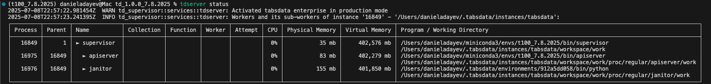

# Tutorial 5: Publishing, Transforming, and Subscribing a CDC Stream from Oracle into PostgreSQL and S3 (`t05_oracle_cdc`)

In this tutorial, we'll explore how Tabsdata enables us to generate a CDC stream from a table in Oracle and subscribe that CDC stream to AWS Iceberg and PostgreSQL. We will do the following steps:

- Set up an Oracle Database in a Docker container
- Set up Tabsdata
- Register a publisher function to read customer data from an Oracle table
- Register a transformer function to capture data changes and store the CDC stream in a new table
- Register subscriber functions to deliver the CDC stream and customer table to PostgreSQL and AWS Iceberg

If you get stuck, check our [Troubleshooting](https://docs.tabsdata.com/latest/guide/10_troubleshooting/main.html) guide or reach out on [Slack](https://join.slack.com/t/tabsdata-community/shared_invite/zt-322toyigx-ZGFioMV2Gbza4bJDAR7wSQ).

For more details on each step, see our initial tutorials ([1](https://github.com/tabsdata/tutorials/tree/main/t01_csv_pub_sub), [2](https://github.com/tabsdata/tutorials/tree/main/t02_postgres_pub_sub), [3](https://github.com/tabsdata/tutorials/tree/main/t03_csv_iceberg_pub_sub), [4](https://github.com/tabsdata/tutorials_staging/tree/main/t04_gsheet_neon)), or refer to our [documentation](https://docs.tabsdata.com/latest/guide/02_getting_started/main.html).


## Prerequisites

- Python 3.12 or higher
- PostgreSQL URL
- Amazon S3 bucket and Glue database
- Tabsdata 0.9.6 or higher


## 1. Clone the Github Repository

```sh
git clone https://github.com/tabsdata/tutorials
cd tutorials/t05_oracle_cdc
export TDX=$(pwd)
```


## 2. Set Up Oracle Database

### 2.1. Build Oracle Database in Docker

Follow [this video tutorial](https://www.youtube.com/watch?v=uxvoMhkKUPE) to set up an Oracle Database using Docker and connect to it through VS Code.

To interact with your Oracle database directly within VS Code, you will need the following [Oracle SQL Developer Extension for VSCode](https://marketplace.visualstudio.com/items?itemName=Oracle.sql-developer). This extension is published by Oracle and is the same extension used in the tutorial video and in the Tabsdata setup instructions below.

Alternatively, you can use the sqlplus command-line tool, which comes with the Oracle Instant Client we'll install in step 2.5.

### 2.2. Create a Default User

After setting up your database, create a fresh Oracle user by running the script in `psql_commands/setup_commands.sql`:

### 2.3. Create the 'customers' Table

Create the 'customers' table and insert sample data by running the `psql_commands/customer_table_create.sql` script:

### 2.4. Test Manual Connection (OPTIONAL)

Test your database connection manually by running the `manual_oracle_connection.py` script:

### 2.5. Install and Configure Oracle Connector Dependencies

Tabsdata requires an additional Oracle dependency in order to run properly:

1. Download [instantclient-basic-macos-arm64.dmg](https://download.oracle.com/otn_software/mac/instantclient/instantclient-basic-macos-arm64.dmg) from the Oracle website
2. Mount the file (by clicking into the downloaded .dmg file)
3. Open a terminal window and change directory to the newly mounted disk image. The base path will always start with ```/Volumes```, but the exact directory name may vary depending on the version. your command should look similar to this:
   ```
   cd /Volumes/instantclient-basic-macos.arm64-23.3.0.x.x
   ```
3. Run the install_ic.sh script:
   ```
   sh ./install_ic.sh
   ```
   This copies the contents of the currently mounted Instant Client .dmg package to ```/Users/$USER/Downloads/instantclient_23_3```. 

4. In Finder, eject the mounted Instant Client package
5. Open your terminal and run the following commands:
   ```sh
   cd /Users/$USER/Downloads/instantclient_23_3
   mkdir lib
   cd lib
   ln -s ../libclntsh.dylib libclntsh.dylib
   ```

## 3. Set Up Tabsdata

### 3.1. Install Tabsdata
```sh
pip install tabsdata --upgrade
```

### 3.2. Set Environmental Variables for Tabsdata
Tabsdata caches any set environmental variables when you run ```tdserver start```, so ensure the following environmental variables are set prior to starting your Tabsdata server. These are necessary dependencies for the oracle connector:

  ```sh
  export PATH="${PATH}:/Users/$USER/Downloads/instantclient_23_3"
  export LD_LIBRARY_PATH="${LD_LIBRARY_PATH}:/Users/$USER/Downloads/instantclient_23_3"
  export DYLD_LIBRARY_PATH="${DYLD_LIBRARY_PATH}:/Users/$USER/Downloads/instantclient_23_3"
  export TNS_ADMIN=/Users/$USER/Downloads/instantclient_23_3
  export ORACLE_HOME=/Users/$USER/Downloads/instantclient_23_3
  ```

At this point, you may also set any environmental variables for credentials you are planning to use for authenticating with Oracle, AWS, and PostgreSQL if you are using environmental variables for credential management


### 3.3. Install Tabsdata

```sh
pip install tabsdata --upgrade
```

### 3.4. Start the Server

```sh
tdserver start
```

Check server status:

```sh
tdserver status
```

You may need to wait for a couple of seconds for the output to appear. Run the status check command until you see both supervisor and apiserver in the output.




### 3.5. Login

```sh
td login localhost --user admin --password tabsdata
```

### 3.6. Create a Collection

```sh
td collection create oracle
```


## 4. Update, Register, and Trigger the Publisher

**Update:**  
Edit `oracle_pub.py` to set your Oracle username and password credentials. 

```python
credentials=td.UserPasswordCredentials(td.EnvironmentSecret("ORACLEDB_USERNAME"),td.EnvironmentSecret("ORACLEDB_PASSWORD")),
```

**Register:**
```sh
td fn register --collection oracle --fn-path $TDX/oracle_pub.py::oracle_pub
```

**Trigger:**
```sh
td fn trigger --collection oracle --name oracle_pub
```

Check transaction status:
```sh
td exec list-trxs
```


Check data in Tabsdata:
```sh
td table sample --collection oracle --name customers
```


## 5. Register and Trigger the Transformer

**Register:**
```sh
td fn register --collection oracle --fn-path $TDX/tfr_cdc.py::tfr_cdc
```

**Trigger:**
```sh
td fn trigger --collection oracle --name tfr_cdc
```

Check transaction status:
```sh
td exec list-trxs
```


Check output:
```sh
td table sample --collection oracle --name customers_cdc
```


## 6. Update, Register, and Trigger the PostgreSQL Subscriber

**Update:**  
Edit `sub_postgres.py` to set your PostgreSQL URI and credentials:

```python
destination=td.PostgresDestination(
    uri="postgresql://<your-neon-uri>",
    destination_table=["public.customers", "public.customers_cdc"],
    credentials=td.UserPasswordCredentials(
        td.EnvironmentSecret("NEON_USERNAME"),
        td.EnvironmentSecret("NEON_PASSWORD")
    ),
    if_table_exists="replace",
),
```

**Register:**
```sh
td fn register --collection oracle --fn-path $TDX/sub_postgres.py::sub_postgres
```

**Trigger:**
```sh
td fn trigger --collection oracle --name sub_postgres
```

Check transaction status:
```sh
td exec list-trxs
```


**Check Output in PostgreSQL**


## 7. Update, Register, and Trigger the AWS Iceberg Subscriber

**Update:**  
Edit `sub_s3_iceberg.py` to set your S3/Glue parameters (uri, region, credentials, tables, auto_create_at):

```python
destination=td.S3Destination(
    uri=[
        "s3://tabsdata-oracle/customer_data/customers-$EXPORT_TIMESTAMP.parquet",
        "s3://tabsdata-oracle/customer_data/customers_cdc-$EXPORT_TIMESTAMP.parquet"
    ],
    region="us-east-2",
    credentials=s3_credentials,
    catalog=td.AWSGlue(
        definition={
            "name": "default",
            "type": "glue",
            "client.region": "us-east-2",
        },
        tables=["tabsdata-oracle.customers", "tabsdata-oracle.customers_cdc"],
        auto_create_at=["s3://tabsdata-oracle", "s3://tabsdata-oracle"],
        if_table_exists="replace",
        credentials=s3_credentials
    )
)
```

**Register:**
```sh
td fn register --collection oracle --fn-path $TDX/sub_s3_iceberg.py::sub_s3_iceberg
```

**Trigger:**
```sh
td fn trigger --collection oracle --name sub_s3_iceberg
```

Check transaction status:
```sh
td exec list-trxs
```


**Check Output in AWS**


## 8. Update Oracle `customers` Table with new Insert, Update, Delete Operations
Now that we have our first commit for the `customers` table in Tabsdata, we need to introduce some updates to the table in oracle and push a second commit into Tabsdata for our CDC stream

### 8.1 Modify the Oracle `customers` table
  Run the SQL script in `psql_commands/customer_table_update.sql` in order to execute an Insert, Update, and Delete Operation into the Oracle 'customers' table 

## 9. Re-trigger the Publisher

```sh
td fn trigger --collection oracle --name oracle_pub
```

### Check the status of transaction

```
td exec list-trxs
```

Output:


## 10. Check the output in AWS and PostgreSQL

You will see the updated `customers` table in AWS and PostgreSQL. The `customers_cdc` table will also have 3 new rows for the INSERT, UPDATE, and DELETE Operations performed on the oracle `customers` table earlier


## Need Help?

If you encounter issues, check the [Troubleshooting Guide](https://docs.tabsdata.com/latest/guide/10_troubleshooting/main.html) or ask in our [Slack Community](https://join.slack.com/t/tabsdata-community/shared_invite/zt-322toyigx-ZGFioMV2Gbza4bJDAR7wSQ).
