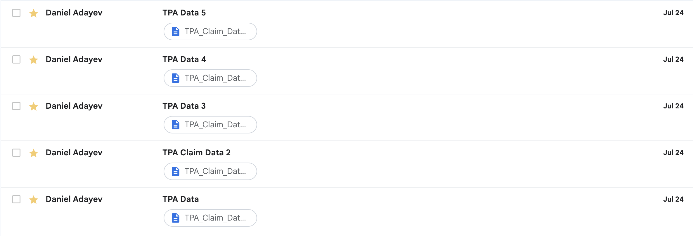
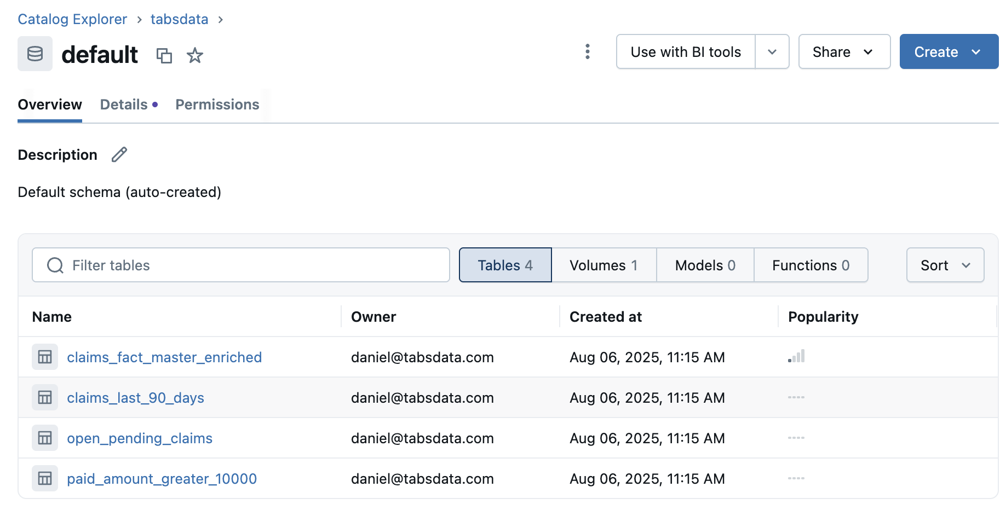

# Tutorial 6: Ingesting Claims Emails into Databricks (`t06_bordeaux_gmail_extract`)

This tutorial shows how Tabsdata can collect claim bordereaux files sent to a Gmail inbox, merge them into a running master fact table, enrich the data with policy details, categorize high‑value subsets, and publish the results to Databricks.

If you get stuck, check our [Troubleshooting](https://docs.tabsdata.com/latest/guide/10_troubleshooting/main.html) guide or reach out on [Slack](https://join.slack.com/t/tabsdata-community/shared_invite/zt-322toyigx-ZGFioMV2Gbza4bJDAR7wSQ).

For more details on each step, see our initial tutorials ([1](https://github.com/tabsdata/tutorials/tree/main/t01_csv_pub_sub), [2](https://github.com/tabsdata/tutorials/tree/main/t02_postgres_pub_sub), [3](https://github.com/tabsdata/tutorials/tree/main/t03_csv_iceberg_pub_sub), [4](https://github.com/tabsdata/tutorials_staging/tree/main/t04_gsheet_neon), [5](https://github.com/tabsdata/tutorials_staging/tree/main/t05_oracle_cdc)).

## Prerequisites

- Python 3.12 or higher
- Tabsdata 1.0.0 or higher
- Gmail account with IMAP enabled and an app password
- MySQL Database
- Databricks workspace and personal access token

## 1. Clone the GitHub Repository

```sh
git clone https://github.com/tabsdata/tutorials
cd tutorials/t06_bordeaux_gmail_extract
```

## 2. Set up your email server

### 2.1 Acquire your Google App Password

In order to connect through IMAP, you will need to generate a 16-digit app password and may do so [here](https://myaccount.google.com/apppasswords) 

### 2.2 [OPTIONAL] Define your mailbox search criteria

The Tabsdata Publisher `claim_fact_pub.py` file is set to pull all unseen email within the last 7 days by default. You may modify the search criteria to suit your needs. Emails accessed through IMAP are automatically marked as read, so it is important to reset the email's status to UNREAD if necessary

```python
date_since = (datetime.now() - timedelta(days=7)).strftime("%d-%b-%Y")
search_criteria = f'(UNSEEN SINCE "{date_since}")'
status, email_ids = mail.search(None, search_criteria)
```

### 2.3 Push Claims Data Into your Inbox

Send the claim files within the `claim_data` folder to your email server. 

<div style="text-align: center;">
  
</div>


Your Server is now ready to connect with Tabsdata

## 3. Set Up MySQL

Create a MySQL Schema called ```tabsdata_db``` and create a table called ```policy_dim``` 

```sql
CREATE TABLE policy_dim (
  policy_number      TEXT,
  months_insured     BIGINT,
  has_claims         TINYINT(1),
  insured_name       TEXT,
  policy_start_date  TEXT,
  reserve_amount     DOUBLE,
  total_incurred     DOUBLE,
  claim_propensity   DOUBLE,
  broker_id          TEXT
);
```

Load the data from ```policy_data/policy_dim.csv``` into the ```policy_dim``` table

## 4. Set Up Tabsdata

### 4.1. Install Tabsdata
```sh
pip install tabsdata --upgrade
pip install 'tabsdata['databricks']'
```

### 4.2. Set Environmental Variables for Tabsdata
You will need to store your credentials for authentication as environmental variables prior to starting the Tabsdata server. Populate your Gmail and Databricks credentials into the terminal command template and run the command in your terminal. This tutorial uses Gmail as the email server, however you may configure any email server as long as you have the correct imap host server address and port number.

```sh
export TDX=$(pwd)
export imap_host=imap.gmail.com
export imap_port=993
export imap_email_user=your_email@gmail.com
export imap_email_password='your_app_password_here'
export mysql_username=username
export mysql_password=password
export databricks_host_url=https://dbc-your-instance.cloud.databricks.com
export databricks_token=dapiXXXXXXXXXXXXXXXXXXXXXXXX
```

NOTE: When the Tabsdata server is started, it caches all available environmental variables, which can then be accessed with the `td.EnvironmentSecret` method in your function code. 

### 4.3. Start the Server

```sh
tdserver start
```

### 4.4. Login

```sh
td login --server localhost --user admin --role sys_admin --password tabsdata
```

### 4.5. Create a Collection

```sh
td collection create --name claim_processing
```

## 5. Register Functions to Tabsdata

All function files must be registered into the tabsdata server with the `td fn register` CLI command. 

Attached below is a detailed explanation of each function and what it's doing:

**Publishers:**
1. `claim_fact_pub.py` retrieves all unread email attachments, standardizes their schemas, dedupes and concatenates all data into a single table, and outputs the data into the Tabsdata Table `claims_fact_today`.

3. `policy_dim_pub.py` loads policy data from the `policy_dim` table within the `tabsdata_db` MySQL database into the `policy_dim` Tabsdata table. This function is triggered to run whenever new data is loaded into the `claims_fact_today` table.

**Transformers:**

2. `append_claims_today_to_master_trf.py` appends the data in `claims_fact_today` to `claims_fact_master` in order to create a master table of all claim data ingested.

4. `master_fact_trf.py` joins and coalesces the policy table with the master claims table to create an enriched claims table called `claims_fact_master_enriched`.

5. `master_categorize_trf.py` categorizes the enriched master table into three child tables:

    - `open_pending_claims`: claims that are currently open
    - `claims_last_90_days`: claims made in the last 90 days
    - `paid_amount_greater_10000`: claims where the paid amount is greater than $10,000

**Subscribers:**

6. `databricks_sub.py` writes the enriched and categorized tables to your Databricks workspace.

You may register and trigger each function sequentially, or register all functions at once. The following commands register each class of functions in batch:

### 5.1. Register your Publishers

```sh
td fn register --coll claim_processing --path $TDX/claim_fact_pub.py::claim_fact_pub
td fn register --coll claim_processing --path $TDX/policy_dim_pub.py::policy_dim_pub
```

### 5.2. Register your Transformers

```sh
td fn register --coll claim_processing --path $TDX/append_claims_today_to_master_trf.py::append_claims_today_to_master_trf
td fn register --coll claim_processing --path $TDX/master_fact_trf.py::master_fact_trf
td fn register --coll claim_processing --path $TDX/master_categorize_trf.py::master_categorize_trf
```

### 5.3. Register your Subscribers

```sh
td fn register --coll claim_processing --path $TDX/databricks_sub.py::databricks_sub
```

## 6. Trigger your Publisher Function

Once all functions are registered, you just need to trigger your `claim_fact_pub` publisher, and Tabsdata automatically runs everything downstream


```sh
td fn trigger --coll claim_processing --name claim_fact_pub
```

## 7. Monitor Output

### 7.1. Monitor Databricks Output
After your function finishes running, you can check your Databricks schema to see the data successfully loaded

<div style="text-align: center;">
  
</div>

### 7.2. Sample Tabsdata Table Output in Tabsdata UI
You can sample your Tabsdata Tables through the [Tabsdata UI](http://localhost:2457/). To access the UI, click the link and fill in the following credentials within the login page:

Username: admin  
Password: tabsdata  
Role: sys_admin  

Once logged in, you may sample any of the tables generated through the workflow, as well as any of their version history, [here](http://localhost:2457/collections/claim_processing)

### 7.3. Sample Tabsdata Table Output in Tabsdata CLI
You may also sample your tables through the Tabsdata CLI

```sh
td table sample --coll claim_processing --name INSERT_TABLE_NAME
```


## Need Help?

Check the [Troubleshooting Guide](https://docs.tabsdata.com/latest/guide/10_troubleshooting/main.html) or ask in our [Slack Community](https://join.slack.com/t/tabsdata-community/shared_invite/zt-322toyigx-ZGFioMV2Gbza4bJDAR7wSQ).

