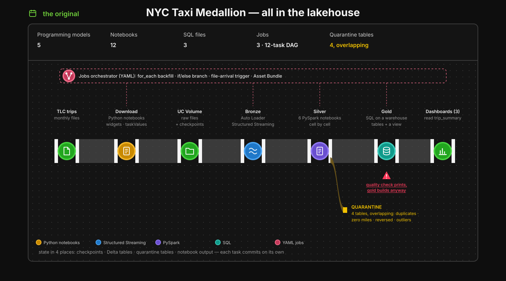
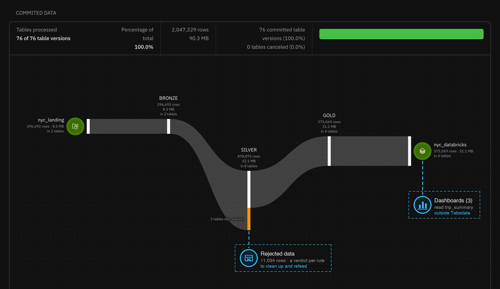

<!-- Copyright 2026 Tabsdata Inc. -->

# Getting data ready for your warehouse. Just ask.

Take an existing use case, built by someone else with no Tabsdata in mind.
Point an agent at it and ask for the same thing in Tabsdata. One system, an AI
conversation and a couple of hours later, there it is.

Same data, same medallion layers, same dashboards at the end, in the
warehouse, where they belong.

## The use case

I didn't want to make up a use case from scratch. Anything I built myself would
have been shaped around Tabsdata, whether I meant it or not. So I went looking
for an existing one;
[NYC-DATABRICKS](https://github.com/Hamza-Bouali/NYC-DATABRICKS) fit the bill.

I've picked NYC-DATABRICKS for what it does, functionally: end to end, a
realistic need. The use case can be implemented with a better choice of
Databricks capabilities and tools (see *Implementing the use case in idiomatic
Databricks* below). This is a port, not a rewrite: same inputs, same layers,
same gold contract, same three dashboards.

Every month the NYC Taxi & Limousine Commission publishes every green-taxi
trip: when and where it started and ended, the distance, the fare, the tip. The
project turns those files into answers for fleet managers (where is demand,
which zones are underserved), finance (revenue, tips, fares that look off) and
compliance (service coverage; invalid, reversed or duplicated records). A
medallion lakehouse on Databricks, and one dashboard per audience.

It is not about Tabsdata instead of the warehouse. The SQL, the analytics and
the dashboards are what a warehouse is great at, and they stay there. The
question is the part before that, getting the data in and getting it ready,
which doesn't have to happen inside the warehouse and may not be the best use
of it. Right tool for the right job.

## Use case current implementation



The original does everything inside the lakehouse, ingestion and prep included,
and every piece asks you to think differently:

- **Download:** Python notebooks on job compute, parameters in widgets, results
  handed on through `dbutils.jobs.taskValues`.
- **Bronze:** Auto Loader, Spark Structured Streaming: triggers, micro-batches,
  checkpoint directories on a Volume.
- **Silver:** PySpark notebooks, cell by cell, quarantining, transforming,
  cleaning and printing a quality report.
- **Gold:** SQL files on a SQL warehouse; declarative, on different compute.
- **The glue:** YAML job graphs with a `for_each` backfill, an if/else branch, a
  file-arrival trigger and a 12-task DAG, deployed as an Asset Bundle.

Five ways of thinking, and state in four places: checkpoints, Delta tables,
quarantine tables, notebook output. Each task commits on its own, and the
quality notebook prints its findings while gold gets built anyway.

## Implementing the use case in idiomatic Databricks

Built from scratch today with Databricks' current tools, it would look quite
different. One Lakeflow Declarative Pipeline for bronze, silver and gold:
Auto Loader streaming tables, expectations that drop or fail rows, AUTO CDC to
deduplicate, materialized views for gold. The pipeline infers its DAG from
table references and manages its own checkpoints. Around it, a small job for
the download and its trigger, all deployed as an Asset Bundle.

Much closer to one way of thinking. It's the fair comparison, and the one I use
below; I didn't implement it for this post.

## Implementing the use case in Tabsdata



In Tabsdata there are three kinds of functions. Publishers bring data in,
transformers work on data already inside, subscribers send it out. They read
and write tables, and every table is immutable and versioned. That's the whole
programming model. The decorator reads the way the data flows: where it comes
from, then where it goes.

```python
@publisher(
    source=LocalFileSrc(paths=["trips/green_*.parquet"], initial_last_modified=...),
    output_tables=["green_taxi_append_raw"],
)
def publish_green_taxi_appends(trips):
    return concat(trips, how="diagonal_relaxed")

@subscriber(
    input_tables=["nyc_gold/trip_summary@HEAD"],
    destination=DatabricksDest(tables=["trip_summary"], if_table_exists="append",
                               watermark_column="td_trx_id"),
)
def sub_gold_trip_summary_to_databricks(trip_summary):
    return trip_summary
```

Ingestion, bronze, silver, gold and egress are all written this way, with the
same TableFrame API, on the same runtime, and data quality is declared on the
same functions. There is no orchestration file: Tabsdata works out the DAG from
the table dependencies, automatically; a table is recomputed when its source
data changes.

And every step is transactional: ingestion, transformation, egress. There is no
way for bronze, silver and gold to end up inconsistent with each other. If
something fails halfway, whatever state is left is a consistent one, never a
half-written one; fix the code or the data, and the rest is computed from
there.

Files land in a local directory here, for simplicity. In a real setup it would
be an S3, GCS or Azure bucket; same function, different connector.

### Data quality, at two levels

Incoming data quality is about the data as it arrives: is the value there, is it
in range, is it what it claims to be. That is Tabsdata's native constructs, as
they come. When standardizing, `IsNotBetween` classifiers flag passenger counts
and payment and rate codes that are out of range or missing; `Enrich` adds
those verdicts as columns without dropping a row, and the next step imputes
from them.

Business-level data quality is about what the data means in this domain. A trip
over 100 miles is an outlier; a negative total is a reversal; two records with
the same pickup, dropoff and zones are the same trip. The constructs are the
same ones; the thresholds, the business key and a couple of derived measures
are domain knowledge. Tabsdata brings the first half, the domain brings the
second.

Operators act on the verdicts: `Filter` publishes the clean rows and sends the
rest to one discard table, `Summary` tallies every rule, and `Fail` aborts a
batch where more than half the rows fail. A rejected row is the original row
plus one verdict column per rule, so *why* a trip was rejected is a query, not
a log line, and the row can be cleaned up and fed back.

## The agent did the typing

This is the part I actually wanted to showcase. Tabsdata is AI first: it ships
an MCP server with medallion skills, creation guides, the SDK reference and a
code verifier, plus the tools to register, run and inspect functions on a live
server. I connected it to Claude Code, pointed it at the original repository,
and asked.

I didn't write the functions, or the runbook. My job was direction and taste;
the agent read the original, wrote and verified the functions, registered and
ran them, read the failures, fixed them, and wrote the scripts.

That's not only the agent being clever; it's also Tabsdata being built for it.
Each makes the other better. The skills tell the agent how a medallion layer is
done in Tabsdata, so it builds from documentation rather than vibes; a verifier
checks every function before it's registered; and the MCP server lets it
operate the live system, as me and with my permissions. Because every table is
versioned and every function deterministic, when something breaks the agent
reads what actually happened instead of guessing. Iterating was cheap.
Abridged, it went like this. 

First, install Tabsdata MCP in the agent and connect to Tabsdata:

```text
$ claude mcp add tabsdata -- python -m tabsdatak.ag.mcp -
Added stdio MCP server tabsdata with command: python -m tabsdatak.ag.mcp - to local config

$ tdk login --server localhost:2457 --user usecase
Password: ************
Login successful.
```

Then start the agent and ask to do the port:

```text
$ claude
✻ Welcome to Claude Code!

> Evaluate https://github.com/Hamza-Bouali/NYC-DATABRICKS for a port to Tabsdata.
  The end result must be the same three dashboards. Use Tabsdata's medallion and
  data quality capabilities.

⏺ Fetch(https://github.com/Hamza-Bouali/NYC-DATABRICKS)
  ⎿  12 notebooks, 5 SQL files, 4 jobs, 3 dashboards
⏺ tabsdata - skills_search (MCP)(keywords: "medallion bronze silver gold")
  ⎿  Found 8 skills
⏺ tabsdata - tool_call (MCP)(lookup_sdk_reference: "dataquality")
  ⎿  classifiers: IsBetween, IsNotBetween, IsPositive, …; operators: Enrich, Filter, Summary, Fail

⏺ It ports cleanly. The original lands the TLC files with notebooks, ingests bronze
  with Auto Loader, builds silver and four quarantine tables in PySpark, and gold in
  SQL; the three dashboards read a single table, trip_summary.

  In Tabsdata:
  - landing: two publishers, the trip files and the zone lookup
  - bronze: append-only CDC for trips, snapshot diff for zones
  - silver: the quality rules as DataQuality classifiers; rejects kept, a verdict per rule
  - gold: dim_zone, dim_date, fct_trip, and trip_summary for the dashboards
  - egress: subscribers write gold to the warehouse

  Want me to generate the functions?

> Yes. The publisher only loads the files; types and the trip_id key go in a silver
  transformer, and flag the values that need imputing with classifiers and Enrich.
  Then register everything and run it: dimensions first, then one month per load.

⏺ Write(tabsdata/functions/silver/tfr_green_taxi_standardized.py)
  ⎿  Wrote 83 lines
⏺ tabsdata - tool_call (MCP)(verify_python_code)
  ⎿  ok: syntax, imports, decorators
⏺ tabsdata - tool_call (MCP)(function_register × 16)
  ⎿  16 functions registered, in dependency order
⏺ tabsdata - tool_call (MCP)(function_execute: publish_zone_lookup_snapshot)
  ⎿  Plan finished. All function runs were successful.
⏺ tabsdata - tool_call (MCP)(function_execute: publish_green_taxi_appends × 7)
  ⎿  7 plans finished. All function runs were successful.

⏺ Done. 296,427 trips in, 285,393 into gold, 11,034 rejected with a verdict per rule.
  dim_zone, dim_date, fct_trip and trip_summary are in the warehouse; the dashboards
  read trip_summary.
```

A corollary of the agent doing the typing: many of my corrections weren't
about what the code did, but about how it reads. I wanted it to look like my
own handwriting (an inside joke from my first job).

## Side by side

How an idiomatic Databricks implementation and the Tabsdata one stack up,
functionally:

| | Idiomatic Databricks | Tabsdata |
| --- | --- | --- |
| Programming model | a declarative pipeline, plus jobs for what it doesn't cover | publishers, transformers and subscribers over versioned tables |
| DAG | inferred inside the pipeline; jobs and triggers wired around it | inferred from table dependencies, end to end |
| Sources | files and streams natively; managed connectors for some systems | connectors in the same model: files, buckets, databases, streams |
| Destination | the lakehouse, with sinks for a few others | any warehouse or system, through subscribers |
| Data quality | expectations that drop, fail or count rows | classifiers and operators that enrich, filter, summarize or fail |
| Rejected rows | counted; keeping them means building a quarantine table | kept, with a verdict per rule, ready to clean up and refeed |
| Consistency | commit per table | multi-table transactions |
| History | time travel, per table | time travel, whole-system consistency |
| Where it runs | Databricks compute | Tabsdata system |

Both are declarative; both infer a DAG. The main differences are in
transactionality and in data quality. Every load in Tabsdata is a multi-table
transaction, so a failure can't leave bronze, silver and gold disagreeing. And
data quality results are data too: rejected rows and their verdicts are tables
you query, clean up and refeed, not counters in a log (more on that in an
upcoming post). The warehouse keeps what it's best at: the tables, the SQL, the
dashboards.

## Try it

All code for this project is available in the [Tabsdata tutorials repository](https://github.com/tabsdata/tutorials), in the `t11_nyc_taxi_databricks` directory. To access it:

```bash
git clone https://github.com/tabsdata/tutorials.git
cd tutorials/t11_nyc_taxi_databricks
```

The repository has the functions, a setup guide for Tabsdata and its MCP
server, and a runbook. Fill in your warehouse details in `usecase.json`; three
commands take you from TLC's files to the dashboards.

A couple of hours, not months. The dashboards didn't notice.
