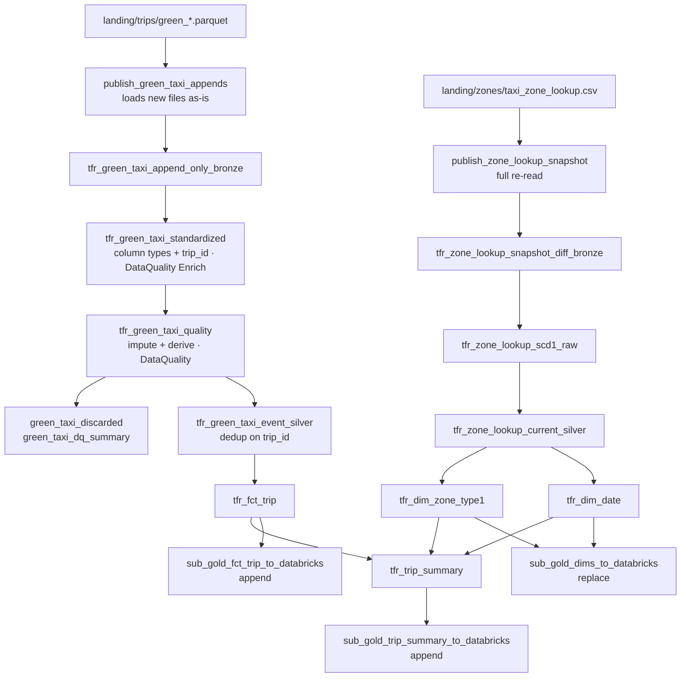

<!-- Copyright 2026 Tabsdata Inc. -->

# Architecture

## Shape of the pipeline

Functions fire when their input tables commit, so triggering a publisher runs
everything below it. Each layer is a collection in its own group (`sources`,
`BRONZE`, `SILVER`, `GOLD`, `destinations`), one directory per group under
`functions/`.

## Decisions

**Landing loads files as they are.** The trip publisher concatenates whatever
files are new and nothing else. Bronze is a faithful record of what TLC shipped,
including its per-month type drift.

**Silver standardizes.** `tfr_green_taxi_standardized` casts every batch to one
set of column types (TLC ships `PULocationID` as int64 one month and int32 the
next, adds `cbd_congestion_fee` in 2025 and `request_source` in 2026-06) and
derives the `trip_id` business key from pickup, dropoff and the two zones.
Casting first keeps the key stable across months. Bronze already declares
`trip_id` as its PK: it records only the column name, which the silver dedup
reads once the column exists.

Standardization also checks the codes that may need imputing, declaratively:
`IsNotBetween` classifiers on passenger count, payment type and rate code, with
an `Enrich` operator that adds their verdicts to the table as plain columns
named for what they mean downstream (`passenger_count_was_imputed`, ...: 0 in
range, 1 out of range, 255 null) without removing any row, and a `Summary` that
tallies them in `green_taxi_standardized_dq_summary`.

**Quality is declared.** `tfr_green_taxi_quality` casts those verdicts to
boolean flags (null counts as out of range), imputes the flagged values, and
derives the trip measures; the `DataQuality` action on its decorator makes every
accept/reject decision. Rejected rows go to one table, `green_taxi_discarded`,
carrying every verdict column; `green_taxi_dq_summary` tallies each rule; a
batch where more than half the trips fail aborts. Duplicated trips are published
and deduped by silver, which keeps one copy.

**Standardization, quality and silver share a collection**, so one load commits
or rolls back all three together.

**Zones are SCD1**: one row per `LocationID`, latest state. The fact keeps
`PULocationID` / `DOLocationID` as plain foreign keys into `dim_zone`.

**Dimensions load first.** `sub_gold_dims_to_databricks` needs both dimensions,
so `dim_date` hangs off the zone table and is built in the same plan as
`dim_zone`.

**`trip_summary` is built in gold.** The dashboards read one wide table; it is
the new fact rows joined to the date and both zone roles, appended per load.
Zone corrections do not restate trips already loaded.

**`@td.` columns stay in Tabsdata.** Anything a warehouse consumer needs is
copied into a regular column: `pickup_datetime`, `trip_date`, `date_sk`.

**No `when/then/otherwise` in the TableFrame API.** A fallback value is
boolean arithmetic (`or_default`), a guarded division zeroes both sides so the
excluded rows become NaN (`ratio`), and a multi-branch label is a join against a
small code table (`anomaly_flag`, `time_of_day`, `payment_type_name`,
`rate_type_name`).

**Time.** TLC timestamps are NYC wall-clock time. Bronze labels pickup UTC
without shifting it and silver does the same to dropoff, so they subtract
correctly and display correctly in a UTC session. `trip_date` and `pickup_hour`
are computed in Tabsdata and do not depend on the reader's time zone.
Day of week follows Spark: 1 = Sunday.
