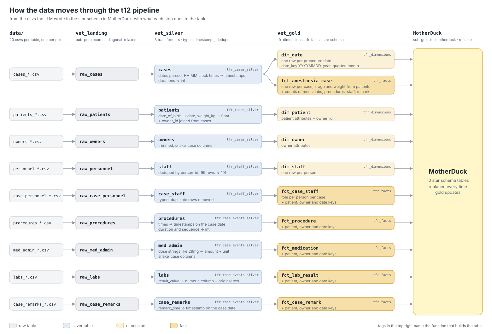

<!-- Copyright 2026 Tabsdata Inc. -->

# From anesthesia PDFs to a star schema in MotherDuck

This project started with a folder of veterinary anesthesia records, one PDF per
patient. Each record covers everything that happened while a dog was under
anesthesia: the drugs given and when, lab results, the procedures, who was in
the room, and a running log of remarks from the anesthesia team.

I wanted to answer questions across all of them, like how long cases run by
month or how recovery looks by breed. A folder of PDFs can't answer any of that,
so the records had to become tables first.

## From PDF to CSV

The first steps happen before any pipeline. I converted each PDF to text, then
had an LLM turn the text into a star schema for that one pet: the same nine
tables every time.

| Table | What a row is |
| --- | --- |
| `cases` | the anesthetic event: date, ASA status, start and end times, recovery quality |
| `patients` | the pet: name, breed, date of birth, weight |
| `owners` | the owner |
| `personnel` and `case_personnel` | the care team and each person's role on the case |
| `procedures` | a procedure within the case, with its own start and end |
| `med_admin` | a drug given: dispensed, dose, administered, discarded, reason |
| `labs` | a lab result or exam finding |
| `case_remarks` | a timestamped note from the anesthesia log |

The LLM is good at this part. What it hands back is twenty small databases, one
per pet, and those still need to become one.

## What comes out of the LLM

Nothing in the output is wrong exactly, but none of it is ready to query:

- **Types are inferred per file.** A 26 kg dog and a 28.5 kg dog give you one
  file where `weight_kg` is an integer and another where it's a float, and a
  plain concat refuses to stack them.
- **Doses are text.** `29mg`, `140ml/hr` and `3ug/kg/min` all arrive as strings,
  number and unit together.
- **One lab column holds everything.** `7.2`, `5-15` and `WNL` sit in the same
  `result_value` column.
- **Times have no date.** The record says `08:31`, and the date is somewhere
  else on the page.
- **People repeat.** Every pet lists its whole care team, so the same
  anesthesiologist shows up in many of the files.
- **Some pages don't extract.** Now and then a file comes back with only its
  header.

The data in the tutorial is generated to the same schemas, with the same
quirks, because the real records are private.

## The first version

My first pass was a few Python scripts built on an earlier Tabsdata release. A
publisher called Python's `glob` inside the function to find every pet's files,
read each one with Polars, cast `weight_kg` to a float inside a try/except and
concatenated the results. A transformer joined `owner_id` onto patients. The
subscriber wrote CSVs out and, inside the function body, pushed each table into
MotherDuck with DuckDB. A separate script loaded the output CSVs into MotherDuck
as well.

It worked, but it was held together by hand. The paths were hardcoded, the
MotherDuck token sat in the subscriber's source file, and the transformer and
subscriber asked the server for its table list at import time to build their
own inputs.

## The Tabsdata version

The rebuild has four layers, one collection each: landing, silver, gold and a
destination that writes to MotherDuck.



### Landing

All the CSVs go in one folder, named `<table>_<patient_id>.csv`. The publisher
declares one glob per table, and Tabsdata hands the function each table's files
as a list of TableFrames, one per pet:

```python
TABLES = ["cases", "patients", "owners", "personnel", "case_personnel",
          "procedures", "med_admin", "labs", "case_remarks"]


def all_pets(pets):
    frames = [frame for frame in (pets or []) if frame is not None]
    return concat(frames, how="diagonal_relaxed") if frames else None


@publisher(
    source=LocalFileSrc(paths=[f"{table}_*.csv" for table in TABLES]),
    output_tables=[f"raw_{table}" for table in TABLES],
)
def pub_pet_records(cases, patients, owners, personnel, case_personnel,
                    procedures, med_admin, labs, case_remarks):
    return (all_pets(cases), all_pets(patients), ..., all_pets(case_remarks))
```

`diagonal_relaxed` takes care of the type drift at ingestion. It lines the
columns up by name and widens `weight_kg` to a type every pet's file fits, so
the integer file and the float file become one table. The raw tables keep
exactly what the LLM wrote. When a number looks off later, I can look up what
came out of the extraction for that pet.

### Silver

Silver is where every column gets its real type. Dates get parsed, clock times
are combined with the case date into timestamps, dose strings split into a
number and a unit, and numeric lab results get their own column next to the
original text:

```python
med_admin = raw_med_admin.select(
    text("drug_name").alias("drug_name"),
    amount("Dose").alias("dose_amount"),
    unit("Dose").alias("dose_unit"),
    amount("Administered").alias("administered_amount"),
    text("Reason Given").alias("reason_given"),
    ...
)
```

Silver also dedupes the care team, which turns 99 personnel rows into 19
people, and joins `owner_id` onto patients from the case record.

### Gold

Gold is the star schema. `fct_anesthesia_case` has a row per case with the
patient's age and weight at the time of the procedure, plus counts of the meds,
labs, procedures, staff and remarks. The event facts (`fct_medication`,
`fct_procedure`, `fct_lab_result`, `fct_case_staff` and `fct_case_remark`) carry
the same patient, owner and date keys, so each one joins straight to
`dim_patient`, `dim_owner`, `dim_staff` and `dim_date`.

### No orchestration

Nothing in the project says what runs after what. Tabsdata works out the plan
from the tables each function reads and writes. One trigger on the publisher ran
all six functions from landing to gold in about 13 seconds on my laptop, and the
subscriber loaded all ten gold tables into MotherDuck in about 9 more. Adding a
pet means dropping its nine CSVs into the folder and triggering the publisher
again.

## Getting it into MotherDuck

Tabsdata doesn't ship a MotherDuck connector. MotherDuck does have a
Postgres-wire endpoint, so the built-in `PostgresDest` was the obvious first
thing to try. But `PostgresDest` writes through SQLAlchemy `INSERT` batches, and
MotherDuck's docs list SQLAlchemy's default `executemany` as unsupported on that
endpoint. Loading a columnar database through row inserts isn't a great fit
anyway.

So I wrote a connector. It's about 150 lines of Python, a package built the same
way as the connectors Tabsdata ships with: a connection class that holds the
token and the database name, a destination class the subscriber declares, and
a plugin that does the write. Tabsdata already hands a destination plugin one
Parquet file per table, and DuckDB reads Parquet natively, so the write is
short:

```python
con = duckdb.connect("md:", config={"motherduck_token": token})
con.execute(f'CREATE DATABASE IF NOT EXISTS "{database}"')
con.execute(f'USE "{database}"')
for table, parquet in zip(dest.tables, tables):
    con.execute(f"CREATE OR REPLACE TABLE \"{table}\" AS SELECT * FROM read_parquet('{parquet}')")
```

The subscriber then looks like any other Tabsdata subscriber:

```python
@subscriber(
    input_tables=[f"vet_gold/{table}" for table in TABLES],
    destination=MotherDuckDest(tables=TABLES, if_table_exists="replace"),
)
def sub_gold_to_motherduck(dim_patient, dim_owner, ..., fct_case_remark):
    return dim_patient, dim_owner, ..., fct_case_remark
```

The token lives on the collection as a Tabsdata secret, not in the code. An
entry point in the connector's `pyproject.toml` is how Tabsdata finds it. The
connector gets installed twice: once locally for `tdk`, and once in the server's
function environment with `tdkserver venv update`. `run.py` does both.

## What Tabsdata changed

Side by side with my first version:

| | First version | Tabsdata version |
| --- | --- | --- |
| Ingestion | `glob` and Polars inside the function body | one `LocalFileSrc` glob per table |
| Type drift | a try/except around one cast | `diagonal_relaxed` at landing, explicit casts in silver |
| Run order | run each script in turn | worked out from table dependencies |
| Credentials | token in the source file | a secret on the destination collection |
| MotherDuck load | DuckDB calls inside a file subscriber, plus a script | a destination connector |
| New pet | rerun the scripts | add nine CSVs and trigger the publisher |

The bigger change is where the work lives. The messy part, stacking twenty
pets' worth of loosely typed CSVs and turning them into a clean star schema,
happens in one place with one API. Every table in it is versioned, so I can
always look at what landing, silver or gold held after a given load.

MotherDuck turned out to be a good partner for that, mostly because of how
little there is to it. Setting it up for this project took a token and a
database name. There's no cluster to size and no warehouse to leave running.
The connector talks to it with the same DuckDB client I'd use on my laptop, and
the database gets created on the first write.

That matters once the data requests start coming in. Each request is some slice
of the case fact against a dimension, and with the star schema in MotherDuck,
answering one is a join and a group by. How long do cases run by month?

```sql
select d.month_name, count(*) as cases, round(avg(f.anesthesia_minutes)) as avg_anesthesia_min
from fct_anesthesia_case f
join dim_date d using (date_key)
group by d.month_name, d.month
order by d.month;
```

| month_name | cases | avg_anesthesia_min |
| --- | --- | --- |
| February | 3 | 192 |
| March | 4 | 208 |
| April | 2 | 263 |
| May | 1 | 245 |
| June | 2 | 183 |
| July | 2 | 269 |
| August | 3 | 262 |
| September | 3 | 254 |

How does recovery look by breed? Same shape, a different dimension:

```sql
select p.breed, count(*) as cases,
       round(avg(f.anesthesia_minutes)) as avg_anesthesia_min,
       round(avg(f.recovery_minutes)) as avg_recovery_min
from fct_anesthesia_case f
join dim_patient p using (patient_id)
group by p.breed
order by cases desc, p.breed
limit 5;
```

| breed | cases | avg_anesthesia_min | avg_recovery_min |
| --- | --- | --- | --- |
| Mixed | 3 | 247 | 21 |
| Australian Shepherd | 2 | 177 | 16 |
| Boxer | 2 | 302 | 24 |
| Cattle Dog | 2 | 156 | 18 |
| Golden Retriever | 2 | 243 | 22 |

The numbers come from the generated tutorial data, so they don't mean anything
clinically. On this dataset most queries came back in tens of milliseconds, and
the slowest, the first query against `fct_medication`, took about two seconds.

Between the two tools, the split of work is clean. Tabsdata owns getting the
data in and keeping it right, and since the subscriber replaces the MotherDuck
tables every time gold changes, whatever I query is the latest version of every
pet's record. MotherDuck owns the questions. When someone asks for a new cut of
the data, I write a query instead of touching the pipeline.

## Try it

All the code is in the [Tabsdata tutorials repository](https://github.com/tabsdata/tutorials),
in the `t12_vet_anesthesia_motherduck` directory:

```bash
git clone https://github.com/tabsdata/tutorials.git
cd tutorials/t12_vet_anesthesia_motherduck
cp usecase-template.json usecase.json   # add your MotherDuck token and database
python tabsdata/run.py
```

`run.py` installs the connector, deploys the four collections and seven
functions, and triggers the publisher. When that plan finishes, the star schema
is in MotherDuck, ready for the first question.
