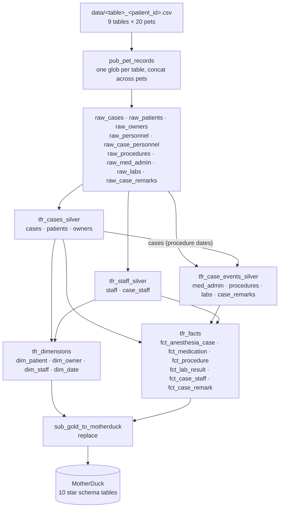

<!-- Copyright 2026 Tabsdata Inc. -->

# Architecture

## Shape of the pipeline

Functions run when their input tables commit, so triggering `pub_pet_records`
runs everything below it: six functions in one plan, then the subscriber once
gold commits. Nothing lists the order. Tabsdata works it out from the tables each
function reads and writes.

## Collections

Each function folder is one collection in its own group. The numeric prefixes
give the order the layers run in.

| Folder | Collection | Group | Functions | Tables |
| --- | --- | --- | --- | --- |
| `01_source` | `vet_landing` | `sources` | `pub_pet_records` | 9 `raw_*` tables |
| `02_silver` | `vet_silver` | `SILVER` | `tfr_cases_silver`, `tfr_case_events_silver`, `tfr_staff_silver` | 9 typed tables |
| `03_gold` | `vet_gold` | `GOLD` | `tfr_dimensions`, `tfr_facts` | 4 dimensions, 6 facts |
| `04_destination` | `vet_motherduck` | `destinations` | `sub_gold_to_motherduck` | writes the 10 gold tables out |

`vet_landing` is created with a `LocalFileSrcConn` pointing at `data/`.
`vet_motherduck` is created with the custom `MotherDuckDestConn`, which holds the
MotherDuck token as a secret and the name of the database to write to.

## The data

An LLM read each pet's anesthesia record and wrote it out as nine CSVs, one per
table, named `<table>_<patient_id>.csv`. All of them sit in one folder. The data
in `data/` is generated to the same schemas, since the real records are private.

| Table | What a row is |
| --- | --- |
| `cases` | an anesthetic event: date, ASA status, times, durations, recovery quality |
| `patients` | a pet: name, species, breed, date of birth, weight |
| `owners` | an owner: name, phone, address |
| `personnel` | a person on the care team |
| `case_personnel` | a person's role on a case |
| `procedures` | a procedure within the case, with start and end times |
| `med_admin` | a drug given: dispensed, dose, administered, discarded, reason |
| `labs` | a lab result or exam finding |
| `case_remarks` | a timestamped note from the anesthesia record |

## Source: `pub_pet_records`

The publisher's `LocalFileSrc` has one path per table, `cases_*.csv`,
`patients_*.csv` and so on. Tabsdata passes each table's matching files to the
function as a list of TableFrames, one per pet. `all_pets` concats them with
`diagonal_relaxed`. CSV types are inferred per file, so `weight_kg` is an
integer in one pet's file and a float in the next, and `diagonal_relaxed`
widens the column to a type every file fits. The raw tables keep what the LLM
wrote, with no casting or cleanup.

## Silver

The three silver transformers give every column its real type and a snake_case
name.

- **`tfr_cases_silver`** parses dates, turns the `HH:MM` clock times into
  timestamps on the case date, and casts durations to integers. The patient
  record has no `owner_id`, so the transformer joins it in from `cases`.
- **`tfr_case_events_silver`** splits dose strings such as `29mg` and
  `140ml/hr` into a number column and a unit column. It separates numeric lab
  results from text ones such as `5-15` and `WNL`, and turns procedure and
  remark times into timestamps. The timestamps need the procedure date, so
  silver `cases` is one of its inputs.
- **`tfr_staff_silver`** dedupes personnel. Each pet's record lists its whole
  care team, so the same people repeat across pets: 99 raw rows become 19
  people.

Every silver column goes through the same helper, `text()`, before it's parsed.
The helper casts the raw column to a string and trims it, because after the
concat a raw column can be an integer, a float, a date or a string.

## Gold

A star schema with the anesthetic case at the center.

- **`tfr_dimensions`** builds `dim_patient`, `dim_owner`, `dim_staff` and
  `dim_date`. `dim_date` has one row per procedure date, keyed by a `YYYYMMDD`
  integer `date_key`.
- **`tfr_facts`** builds `fct_anesthesia_case`, one row per case. It carries the
  patient's age and weight at the time of the procedure, plus counts of the
  procedures, medications, lab results, staff and remarks on the case. The event
  facts (`fct_medication`, `fct_procedure`, `fct_lab_result`, `fct_case_staff`,
  `fct_case_remark`) get the same `patient_id`, `owner_id` and `date_key`, so they
  join to the dimensions directly without going through the case fact.

## Destination: `sub_gold_to_motherduck`

The subscriber reads the 10 gold tables and returns them unchanged.
`MotherDuckDest` writes each one to a MotherDuck table of the same name with
`if_table_exists="replace"`, so MotherDuck always holds the latest gold version.

## The MotherDuck connector

Tabsdata 2.1 has no MotherDuck connector, so `motherduck_connector/` is a small
package, `tabsdata-conn-motherduck`, built the same way as the built-in
connectors:

- **`MotherDuckDestConn`:** the connection, with the token (a secret) and the
  database name.
- **`MotherDuckDest`:** the destination a subscriber declares, with its target
  tables and `if_table_exists`.
- **`MotherDuckDestPlugin`:** the plugin that does the write. Tabsdata hands it
  one Parquet file per table. It connects with DuckDB, creates the database if
  it's missing, and runs `CREATE OR REPLACE TABLE ... AS SELECT * FROM
  read_parquet(...)` for every table inside one transaction.
- **`MOTHERDUCK_DEST`:** the `DestDef` that ties the three together. It's
  registered under the `tabsdatak.connectors` entry point in `pyproject.toml`,
  which is how Tabsdata discovers it.

The package has to be installed in two places:
- **Your Python environment:** `tdk` imports the connector to validate the
  connection and register the subscriber.
- **The server's `fn` environment:** functions run in their own sealed virtual
  environment on the server. `tdkserver venv update --name fn` rebuilds that
  environment with the connector added, then the instance is started again.

## `run.py`

| Step | What it does |
| --- | --- |
| `connector` | installs the connector locally and in the server's `fn` environment, then restarts the instance |
| `deploy` | logs in and creates the project, the `SILVER` and `GOLD` groups, the four collections with their connections, then registers the seven functions in dependency order |
| `load` | triggers `pub_pet_records`; everything downstream, including the MotherDuck load, follows from it |

Settings come from `usecase.json`, a copy of `usecase-template.json` with the
MotherDuck token filled in.

## Decisions

**The raw layer is the LLM's output as written.** When a number looks wrong in
gold, `raw_*` shows exactly what the LLM wrote for that pet, and the fix goes in
silver or in the extraction prompt rather than in the data.

**Types are fixed in silver, not at ingestion.** The CSV reader has no
read-everything-as-text option, and casting in the publisher would also touch
Tabsdata's system columns. `diagonal_relaxed` gets the files into one table, and
silver decides what each column really is.

**Clock times become timestamps.** The records give times like `08:31` and a
date elsewhere on the page. Silver combines them so durations and orderings work
in SQL without string handling.

**Event facts carry the dimension keys.** Every fact joins straight to
`dim_patient`, `dim_owner` and `dim_date`, so an ad hoc query never has to hop
through `fct_anesthesia_case`.

**MotherDuck is replaced, not appended.** Gold is small and fully recomputed on
every load, so replacing the tables keeps MotherDuck identical to gold without
any merge logic.

**A custom connector instead of `PostgresDest`.** MotherDuck has a
Postgres-wire endpoint, but `PostgresDest` writes through SQLAlchemy `INSERT`
batches, and MotherDuck's endpoint documents SQLAlchemy's default `executemany`
as unsupported. The DuckDB client loads the Parquet files Tabsdata already
produces in bulk.
